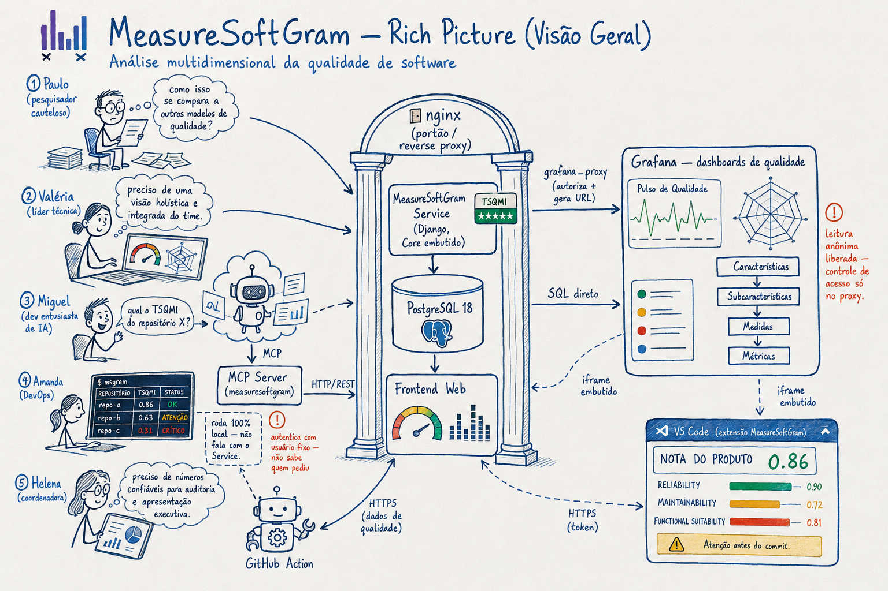
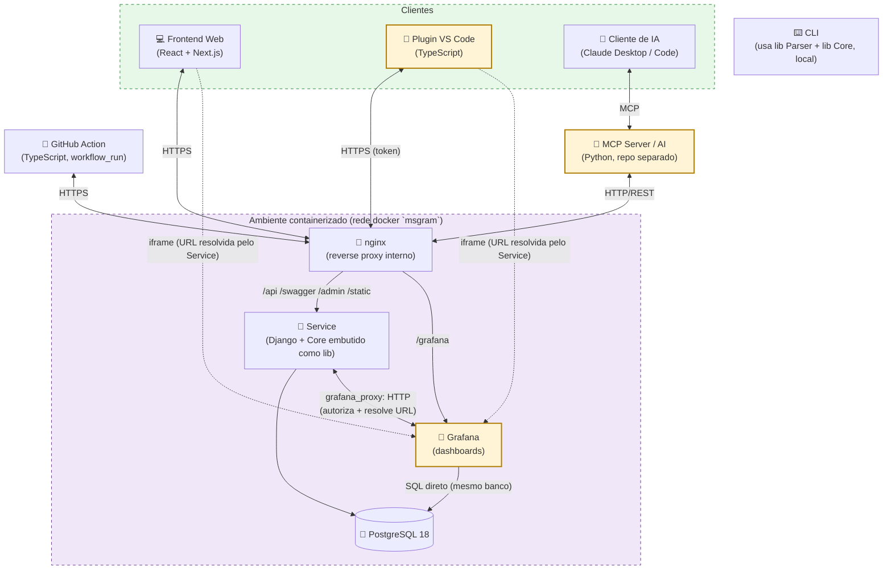
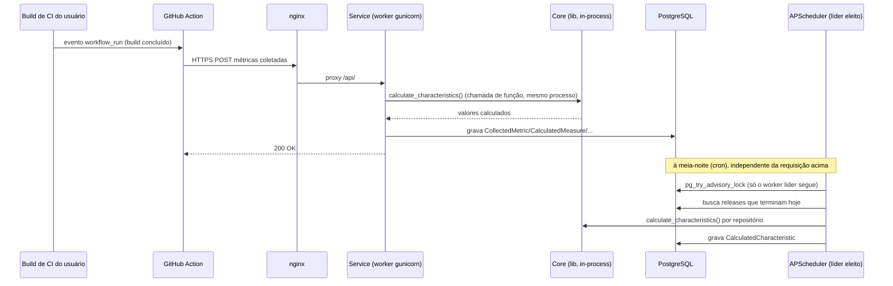
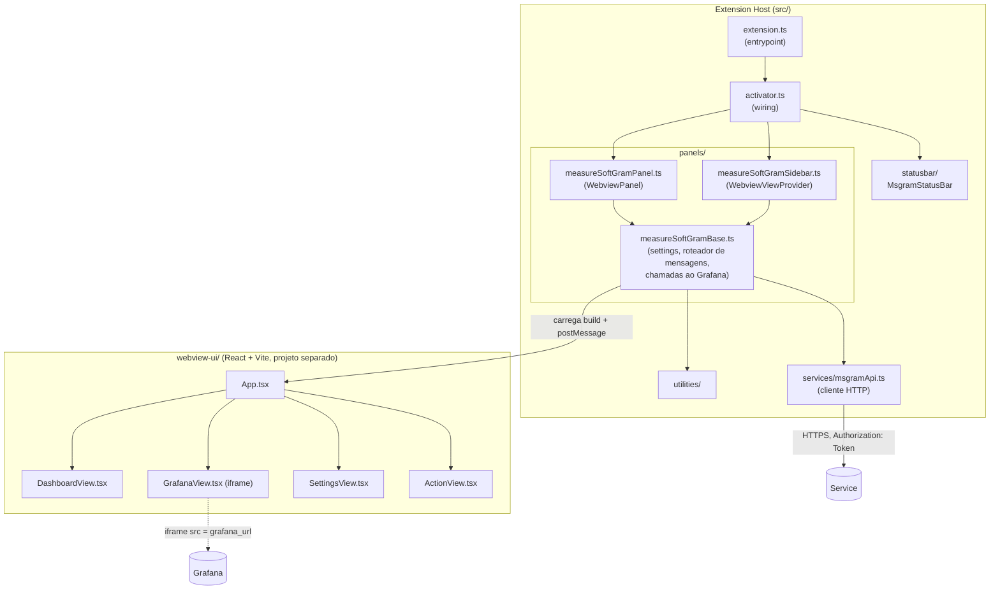
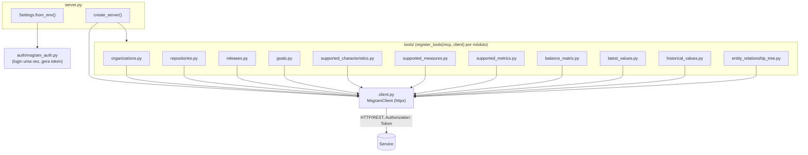
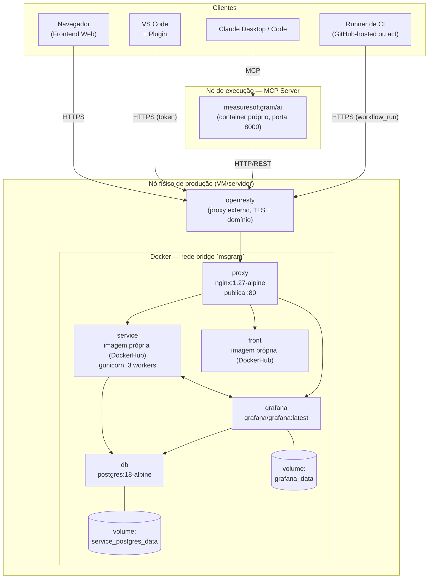
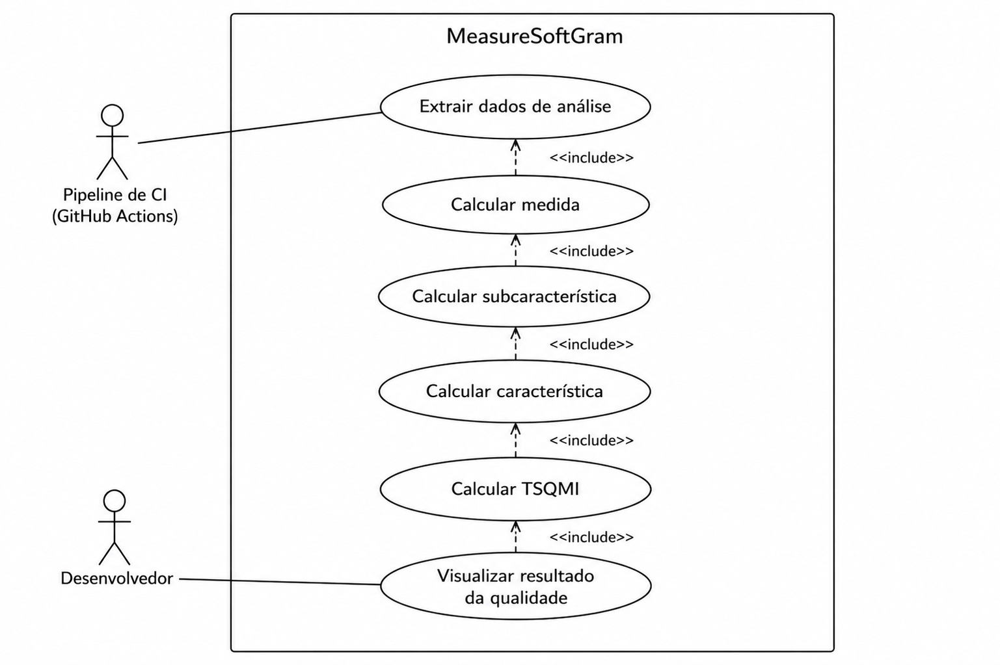
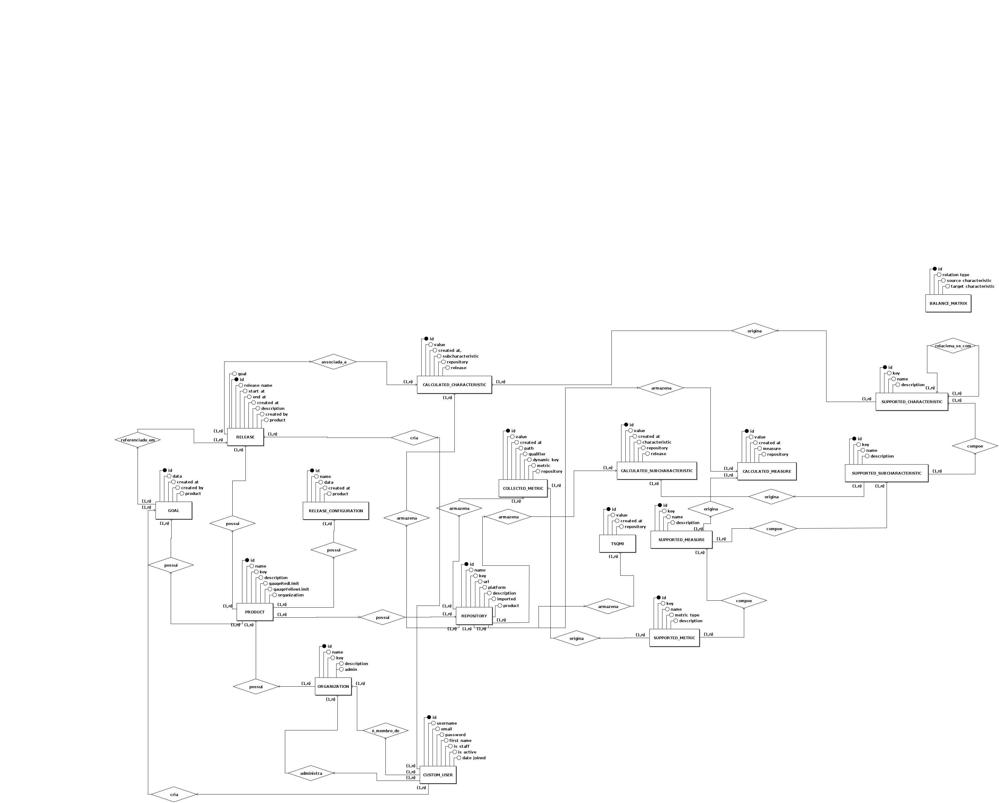
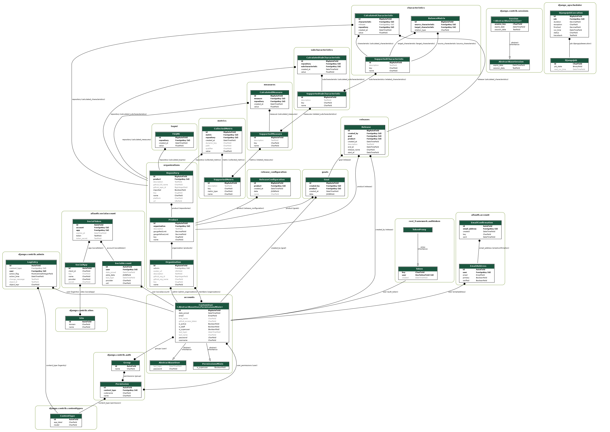

# Documento de Arquitetura

## Introdução

<p align = "justify"> &emsp;&emsp; A finalidade deste documento é apresentar de forma geral os aspectos mais significativos da arquitetura do projeto MeasureSoftwareGram. </p>

<p align = "justify"> &emsp;&emsp; Neste documento são apresentados os seguintes pontos: os serviços e as tecnologias utilizadas em cada parte do projeto, modelo de arquitetura seguido atualmente e as motivações que guiam essas escolhas. </p>

<p align = "justify"> &emsp;&emsp; Através desse documento, é possível obter um melhor entendimento da arquitetura do projeto, permitindo ao leitor a compreensão do funcionamento do sistema e as abordagens utilizadas para o seu desenvolvimento.</p>

### Visão Geral

A arquitetura do projeto está documentada seguindo o modelo **4+1 de Philippe Kruchten**, que organiza a descrição arquitetural em cinco perspectivas complementares:

* **Visão Lógica:** Principais componentes do sistema, suas responsabilidades e como se comunicam;
* **Visão de Processo:** Aspectos de concorrência, distribuição e comunicação entre processos em tempo de execução;
* **Visão de Desenvolvimento:** Organização do código-fonte em módulos e pacotes;
* **Visão Física:** Mapeamento dos componentes de software nos nós de infraestrutura;
* **Visão de Casos de Uso (+1):** Cenários-chave que exercitam e validam as demais visões.

Além das visões arquiteturais, este documento também apresenta o modelo de dados do sistema e as metas e restrições de arquitetura.

#### Rich Picture

<p align = "justify"> &emsp;&emsp; O rich picture abaixo apresenta, de forma informal, o ecossistema do MeasureSoftGram: quem são os atores (desenvolvedores, gestores de qualidade, pipelines de CI e agentes de IA), quais sistemas eles usam e como esses sistemas se conectam. Ele complementa — sem substituir — o diagrama técnico da seção Visão Lógica, mais abaixo, que detalha componentes e protocolos. </p>



## Representação de Arquitetura

### Linguagens

- **Python**: Uma linguagem de programação poderosa, flexível e de fácil aprendizado, que é amplamente utilizada devido à sua legibilidade, produtividade e capacidade de integração com outros sistemas. [<a href=./#referencias>1</a>]

- **JavaScript/TypeScript**: Uma linguagem de programação que permite a você implementar itens complexos em páginas web, como conteúdos que se atualiza em um intervalo de tempo, mapas interativos ou gráficos 2D/3D animados, etc. É a terceira camada do bolo das tecnologias padrões da web (HTML, CSS e Javascript). TypeScript por sua vez é uma linguagem de programação fortemente tipada que se baseia em JavaScript, oferecendo melhores ferramentas em qualquer escala. [<a href=./#referencias>2</a>] [<a href=./#referencias>3</a>]

#### Tecnologias

- **React**: Uma biblioteca utilizada para desenvolvimento de interfaces de usuário nativas e web. Essa ferramenta proporciona o desenvolvimento de sites com mais facilidade e rapidez em relação aos tradicionais HTML, CSS e JavaScript. [<a href=./#referencias>4</a>]

- **Next.js**: Um framework de código aberto criado pela Vercel que estende os recursos do React. Com essa ferramenta, é possível usufruir de recursos como geração de páginas estáticas e renderização do lado do servidor, otimizando o desenvolvimento Web. [<a href=./#referencias>5</a>]

- **Django**: Um framework web Python de alto nível que incentiva o desenvolvimento rápido e um design limpo e pragmático. Construído por desenvolvedores experientes, ele cuida de grande parte do incômodo do desenvolvimento da Web, para que você possa se concentrar em escrever seu aplicativo sem precisar reinventar a roda. É gratuito e de código aberto. [<a href=./#referencias>6</a>]

- **Jupyter Notebook**: Um aplicativo baseado na Web para a criação de documentos que combinam código (Python) ao vivo com texto narrativo, equações e visualizações. [<a href=./#referencias>7</a>]

- **PyPI**: O Python Package Index é um repositório para armazenar pacotes de código escritos na linguagem de programação Python. [<a href=./#referencias>8</a>]

#### Gerenciamento de pacotes e runtime

<p align = "justify"> &emsp;&emsp; A partir do semestre 2026.1 o time modernizou o ferramental de runtime e pacotes do <strong>Service</strong> e do <strong>Front</strong> — as decisões abaixo estão registradas nos respectivos pull requests de modernização da stack Docker (PR <a href="https://github.com/fga-eps-mds/2026.1-MeasureSoftGram-Service/pull/1">#1</a> do Service e PR <a href="https://github.com/fga-eps-mds/2026.1-MeasureSoftGram-Front/pull/5">#5</a> do Front). As bibliotecas Python publicadas no PyPI (<strong>Core</strong>, <strong>Parser</strong> e <strong>CLI</strong>) não passaram por essa modernização: continuam em <code>pip</code> + <code>requirements.txt</code>, testadas via <code>tox</code>, com <code>requires-python = ">=3.9"</code> no <code>pyproject.toml</code> e sem <code>Dockerfile</code>/<code>docker-compose.yml</code> próprio — conferido contra a branch <code>develop</code> dos três repositórios. </p>

- **uv**: gerenciador de pacotes Python utilizado apenas no **Service**, em substituição ao pip e ao poetry. Core, Parser e CLI seguem em `pip`.
- **pnpm**: gerenciador de pacotes JavaScript utilizado no Front, em substituição ao npm.
- **Python 3.12**: versão fixada apenas no **Service**, via `pyproject.toml` e imagem Docker oficial. Core, Parser e CLI declaram `requires-python = ">=3.9"` e não fixam uma versão específica.
- **Node 20 LTS**: versão fixada no Front, via `.nvmrc` e imagem Docker oficial.
- **Imagens Docker** com tags fixas (como `python:3.12-slim` ou `postgres:18-alpine`), em vez de `:latest` — aplicável aos containers do Service, Front, Grafana, banco e proxy; Core, Parser e CLI não têm imagem Docker própria, por serem bibliotecas/CLI distribuídas via PyPI.
- **Docker Compose v2** com `compose watch`, em substituição ao `docker-compose` v1 — usado no Service.

#### Banco de dados

- **PostgreSQL 18**: atualização do PG12/14 herdado para a versão estável mais recente do PostgreSQL, com tag fixada (`postgres:18-alpine`). Registrada no PR de modernização da stack Docker do Service ([#1](https://github.com/fga-eps-mds/2026.1-MeasureSoftGram-Service/pull/1)). [<a href=./#referencias>9</a>]

#### Containers e imagens (estrutura evoluída)

<p align = "justify"> &emsp;&emsp; O Service evoluiu de um único container Django+Postgres para uma stack com cinco containers, orquestrados por dois arquivos <code>docker compose</code> distintos: um para desenvolvimento (raiz do repositório) e um para produção (<code>deploy/docker-compose.prod.yml</code>). </p>

| Container | Imagem (dev) | Imagem (produção) | Observações |
| :--- | :--- | :--- | :--- |
| `db` | `postgres:18-alpine` | `postgres:18-alpine` | volume nomeado `service_postgres_data`; publica `5432` só em `127.0.0.1` no dev, sem publicar porta em produção |
| `service` | build local (`Dockerfile` multi-stage: builder com `uv` + runtime `python:3.12-slim-bookworm`) | `${DOCKERHUB_USERNAME}/service:${SERVICE_IMAGE_TAG}` (pull do DockerHub, buildada no CI) | `compose watch` sincroniza `./src` em dev; produção só puxa a imagem, não builda |
| `front` | build local (`node:20-alpine`, `pnpm`) | `${DOCKERHUB_USERNAME}/front:${FRONT_IMAGE_TAG}` | variáveis `SERVICE_URL`, `GITHUB_CLIENT_ID` etc. entram como build-arg no CI |
| `grafana` | `grafana/grafana:latest` | `grafana/grafana:latest` | plugin `volkovlabs-echarts-panel`; volume nomeado `grafana_data`; provisionamento via bind mount de `grafana/provisioning` e `grafana/dashboards` |
| `proxy` | — (só existe em produção) | `nginx:1.27-alpine` | único container que publica porta no host (`80:80`); ver seção "Nginx e Grafana" logo abaixo |

<p align = "justify"> &emsp;&emsp; Todos os containers (exceto o proxy) ficam em uma rede <code>bridge</code> própria chamada <code>msgram</code>, isolada do host — <code>db</code> e <code>service</code> não publicam porta nenhuma em produção, só são alcançáveis pelos outros containers da mesma rede. Healthchecks (<code>pg_isready</code> no banco, <code>curl</code> no <code>/swagger/</code> do Service) controlam a ordem de subida via <code>depends_on: condition: service_healthy</code>. Segredos (tokens, senhas de banco e do Grafana) vivem em arquivos <code>.env</code> dentro de <code>deploy/env-vars/</code>, nunca versionados no repositório. </p>

#### Nginx e Grafana (integração)

<p align = "justify"> &emsp;&emsp; Em produção existe um proxy nginx <strong>interno</strong> à stack (container <code>proxy</code>, imagem <code>nginx:1.27-alpine</code>), que fica atrás de um proxy <strong>externo</strong> da máquina (openresty, fora do escopo deste compose) responsável por terminar o domínio e o TLS. O nginx interno publica a porta <code>80</code> do host e roteia por caminho: </p>

| Rota | Destino | Observação |
| :--- | :--- | :--- |
| `/api/`, `/swagger/`, `/admin/`, `/static/` | `service:8080` | backend Django (DRF) |
| `/grafana/` | `grafana:3000` | com upgrade de conexão para WebSocket (necessário para o Grafana Live) |
| `/` | `front:3000` | frontend Next.js |

<p align = "justify"> &emsp;&emsp; O Grafana roda como container independente do ciclo de vida do Django, com dashboards de qualidade provisionados automaticamente a partir de arquivos JSON (<code>grafana/dashboards/*.json</code>) e um datasource Postgres que consulta <strong>diretamente</strong> o mesmo banco do Service — sem passar pela API REST. Para permitir a incorporação via <code>iframe</code> no Frontend e no Plugin VS Code, o Grafana é configurado com acesso anônimo somente-leitura (<code>GF_AUTH_ANONYMOUS_ENABLED</code>, papel <code>Viewer</code>) e <code>GF_SECURITY_ALLOW_EMBEDDING=true</code>. </p>

<p align = "justify"> &emsp;&emsp; Como o Grafana fica aberto para leitura anônima, o controle de acesso por produto/repositório é feito no lado do Service, por um app Django dedicado, o <code>grafana_proxy</code>. Ele expõe dois endpoints autenticados: </p>

- `GET /api/v1/grafana/dashboards/` — lista os dashboards disponíveis;
- `GET /api/v1/grafana/dashboard/{uid}/?product_id=...&repository_id=...` — valida se o usuário tem permissão sobre aquele produto/repositório (`CanAccessProduct`, `CanAccessDashboard`) e devolve a URL pública do dashboard já filtrada, pronta para ser usada como `src` do `iframe`.

<p align = "justify"> &emsp;&emsp; Ou seja: o Frontend e o Plugin VS Code nunca chamam o Grafana diretamente para autorização — sempre pedem a URL ao <code>grafana_proxy</code> do Service, e só então carregam essa URL num <code>iframe</code>. </p>

#### Serviços

- **CLI** Abreviação de "interface de linha de comando". Este é um programa que permite aos usuários criar comandos para funções específicas passando instruções para o computador. Roda inteiramente local: usa a biblioteca `msgram-parser` (Parser) para interpretar os dados de entrada e a `msgram_core` (Core) para calcular o modelo de qualidade, sem se comunicar com o `Service` pela rede.

- **Frontend Web** Esta é a aplicação interface web que permite aos usuários analisar e acompanhar os produtos pelo navegador. Também embute, via `iframe`, os dashboards do Grafana obtidos através do `Service`.

- **Service** Este é o programa responsável por se comunicar com a aplicação `Frontend Web` e fornecer todos os dados necessários para a aplicação web. Importa `Core` (`msgram_core`) como biblioteca Python para calcular características, subcaracterísticas, medidas e o TSQMI dentro do próprio processo Django — não há chamada de rede entre `Service` e `Core`.

- **Core** Biblioteca Python (publicada no PyPI como `msgram_core`) que implementa o modelo matemático de qualidade (características, subcaracterísticas, medidas e TSQMI). É consumida diretamente como dependência pelo `Service` e não roda como um serviço de rede próprio.

- **Parser** Biblioteca Python (publicada no PyPI como `msgram-parser`) com a capacidade de interpretar a estrutura gramatical ou sintática dos dados de entrada, a fim de transformá-los em uma representação interna mais adequada para processamento. É consumida diretamente pela `CLI`, e não é uma dependência do `Service`.

- **Github Action** Action customizada do Github que permite realizar a análise de um certo repositório. É disparada pelo evento `workflow_run` ao final do build de CI configurado pelo usuário, e se comunica com o `Service` via HTTPS para enviar os dados coletados.

- **MCP Server (AI)** Servidor Python (biblioteca `mcp`/FastMCP) que expõe o MeasureSoftGram a clientes de inteligência artificial por meio do protocolo MCP, nos transports `streamable-http` (`/mcp`, padrão) e `sse` (`/sse`, alternativo, selecionável via `MCP_TRANSPORT=sse`) — ambos confirmados no código (`server.py`) e no guia de uso testado pela equipe (`docs/manual-de-instalacao/guia-mcp.md`). Fica em repositório separado (`fga-eps-mds/2026.1-MeasureSoftGram-AI`, publicado como imagem `measuresoftgram/ai`) e se comunica com o `Service` via HTTP/REST, autenticando-se **uma única vez na subida do processo** com uma conta de serviço fixa (`MSGRAM_USER`/`MSGRAM_PASSWORD`, endpoint `accounts/login/`) — o token obtido é reutilizado em todas as chamadas das tools, ou seja, o MCP não propaga a identidade de quem está do outro lado do agente de IA. Agentes que só suportam `stdio` (como o Claude Desktop) precisam de um proxy local (`npx mcp-remote`, ponte `stdio` ↔ `streamable-http`) entre o agente e o servidor.

- **Plugin VS Code** Extensão para o Visual Studio Code (`fga-eps-mds/2026.1-MeasureSoftGram-Plugin`) que leva o painel de qualidade (TSQMI e características), os dashboards do Grafana (embutidos via `iframe`) e a execução local do workflow da `Github Action` (via Docker + `nektos/act`) para dentro do editor. Autentica-se no `Service` via token (`Authorization: Token <token>`), guardado no Secret Storage do VS Code, e nunca chama o Grafana diretamente — sempre por meio dos endpoints de proxy do `Service`.

- **Grafana** Ferramenta de terceiros usada para os dashboards analíticos de qualidade. Roda como container próprio, com dashboards provisionados via arquivos JSON e um datasource que consulta diretamente o mesmo PostgreSQL do `Service` (sem passar pela API Django). O `Service` expõe um app `grafana_proxy` que autoriza o acesso por produto/repositório e resolve as URLs dos dashboards antes de repassá-las ao `Frontend Web` e ao `Plugin VS Code`.

---

## Visões Arquiteturais (4+1)

### Visão Lógica

<p align = "justify"> &emsp;&emsp; A visão lógica descreve os principais componentes do sistema, suas responsabilidades e como se comunicam entre si. O diagrama abaixo apresenta os componentes do MeasureSoftGram, as tecnologias utilizadas em cada um e as relações entre eles. <code>Core</code> (<code>msgram_core</code>) é importado como <strong>biblioteca Python dentro do próprio processo do Service</strong>, e <code>Parser</code> (<code>msgram-parser</code>) é uma biblioteca consumida apenas pela <code>CLI</code> — nenhum dos dois roda como processo de rede próprio. A CLI, por sua vez, não chama o Service pela rede: ela calcula e grava os resultados localmente. </p>



---

### Visão de Processo

<p align = "justify"> &emsp;&emsp; Esta visão descreve os aspectos de concorrência, distribuição e comunicação entre processos em tempo de execução. O MeasureSoftGram <strong>não usa fila de mensagens nem broker</strong> (não há Celery, Redis ou RabbitMQ na stack) — a comunicação entre os processos de rede é majoritariamente síncrona (request/response), e a única concorrência existente roda dentro do próprio processo do Service. </p>

#### Processos de longa duração (sempre ativos)

| Processo | Natureza | Comunicação |
| :--- | :--- | :--- |
| `Service` (gunicorn, WSGI síncrono) | Múltiplos workers (`GUNICORN_WORKERS`, padrão 3), modelo *prefork* — cada worker é um processo OS separado | HTTP/REST, síncrono |
| `Grafana` | Container independente, ciclo de vida próprio | Consulta o PostgreSQL diretamente via SQL; conversa com o Service via `grafana_proxy` (HTTP) só para autorização |
| `MCP Server (AI)` | Container HTTP de longa duração, repositório separado | Recebe chamadas MCP do agente de IA e as traduz em chamadas HTTP síncronas ao Service |

#### Concorrência dentro do Service (in-process, sem fila)

<p align = "justify"> &emsp;&emsp; Existem exatamente dois mecanismos de concorrência, ambos internos ao processo Django — não há execução distribuída: </p>

1. **Job agendado diário (APScheduler).** O app `releases` registra, no boot de cada worker (`AppConfig.ready()`), um `BackgroundScheduler` do `django-apscheduler` que roda `get_releases_and_create_results` todo dia à meia-noite (`America/Sao_Paulo`), calculando as características das releases que terminam naquele dia. Como o gunicorn sobe múltiplos workers (processos separados), cada um tentaria iniciar seu próprio agendador — para evitar duplicação, o primeiro worker a conseguir um **advisory lock do Postgres** (`pg_try_advisory_lock`) vira o "líder" e é o único que efetivamente agenda o job; os demais detectam o lock ocupado e não agendam nada.
2. **Thread "fire-and-forget" na criação de repositório.** Ao cadastrar um repositório pela API, o Service dispara uma `threading.Thread` (`daemon=True`) que tenta acionar o workflow de GitHub Actions do próprio usuário (via GitHub API, com o token OAuth armazenado) e, se isso falhar, gera dados de qualidade sintéticos localmente para a interface não ficar vazia. Não há fila, persistência do job nem retentativa: se o worker reiniciar no meio da execução, a thread é perdida silenciosamente.



#### Processos efêmeros / orientados a evento

- **GitHub Action**: cada execução é um runner novo (hospedado no GitHub ou simulado localmente via `nektos/act`, usado pelo Plugin VS Code), que sobe, roda e termina — disparado pelo evento `workflow_run` ao final do build do usuário.
- **CLI**: comando único que roda até concluir e encerra; não abre conexão de rede com o Service (usa as bibliotecas Parser e Core localmente e grava o resultado em arquivo).

---

### Visão de Desenvolvimento

<p align = "justify"> &emsp;&emsp; A visão de desenvolvimento apresenta a organização do código-fonte em módulos e pacotes para cada repositório do projeto. </p>

#### Web


#### Core


#### CLI


#### Parser


#### Action


#### Plugin VS Code

<p align = "justify"> &emsp;&emsp; O Plugin (repositório <code>fga-eps-mds/2026.1-MeasureSoftGram-Plugin</code>) é dividido em dois projetos: o código do host da extensão (<code>src/</code>, Node/TypeScript) e uma aplicação React/Vite independente (<code>webview-ui/</code>) que é compilada e empacotada dentro da extensão para renderizar a interface dos painéis. Os dois só se comunicam por <code>postMessage</code>/<code>acquireVsCodeApi</code> — a <code>webview-ui</code> nunca chama a API do Service diretamente. </p>



<p align = "justify"> &emsp;&emsp; Ponto de atenção de manutenção: <code>MeasureSoftGramPanel</code> e <code>MeasureSoftGramSidebar</code> herdam de <code>MeasureSoftGramBase</code>, mas duplicam a lógica de salvar/rodar o workflow da Action (<code>save_action</code>/<code>run_action</code>) em vez de compartilhá-la. </p>

#### MCP Server (AI)

<p align = "justify"> &emsp;&emsp; O repositório <code>fga-eps-mds/2026.1-MeasureSoftGram-AI</code> (pacote <code>msgram_mcp</code>, distribuído em <code>src/</code>) segue um padrão simples de registro de ferramentas: <code>server.py</code> monta o <code>FastMCP</code> e chama a função <code>register_tools(mcp, client)</code> de cada módulo em <code>tools/</code>, que por sua vez usa o <code>MsgramClient</code> (<code>client.py</code>) — um wrapper fino sobre <code>httpx</code> — para consultar o <code>Service</code>. A autenticação (<code>auth/msgram_auth.py</code>) roda uma única vez, na criação das <code>Settings</code>, e gera o token reaproveitado por todas as tools. </p>



<p align = "justify"> &emsp;&emsp; Ponto de atenção: como o token é obtido uma única vez com uma conta de serviço fixa (<code>MSGRAM_USER</code>/<code>MSGRAM_PASSWORD</code>), todas as chamadas das tools ao <code>Service</code> acontecem com essa identidade — o MCP não tem hoje um mecanismo de repassar a identidade do usuário do agente de IA para a autorização no <code>Service</code>. </p>

#### Grafana

<p align = "justify"> &emsp;&emsp; O Grafana não é um pacote de código do MeasureSoftGram — é uma ferramenta de terceiros provisionada por arquivos de configuração. Por isso, em vez de um diagrama de pacotes, documentamos a estrutura de provisionamento (dentro do repositório do Service): </p>

```
grafana/
├── dashboards/                        # dashboards provisionados (JSON)
│   ├── dashboard-visao-geral.json
│   ├── dashboard-evolucao.json
│   ├── dashboard-ecg-tsqmi.json
│   └── dashboard-saude-qualidade-repositorio.json
├── provisioning/
│   ├── datasources/measuresoftgram.yml   # datasource Postgres (aponta pro mesmo banco do Service)
│   └── dashboards/provider.yml           # provider que carrega os JSONs acima automaticamente
└── seed_planejado_vs_realizado.sql       # dados de apoio para os dashboards
```

---

### Visão Física

<p align = "justify"> &emsp;&emsp; Um diagrama de implantação especifica os construtos que podem ser usados para definir a arquitetura de execução de sistemas e a atribuição de artefatos de software aos elementos do sistema. Para descrever um site, por exemplo, um diagrama de implantação mostraria quais componentes de hardware ("nós") existem (por exemplo, um servidor web, um servidor de aplicação e um servidor de banco de dados), quais componentes de software ("artefatos") rodam em cada nó e como as diferentes peças estão conectadas. </p>

Os nós aparecem como caixas tridimensionais, e os componentes alocados a cada nó aparecem como retângulos dentro das caixas. Os nós podem ter subnós, que aparecem como caixas aninhadas. Um único nó em um diagrama de implantação pode representar conceitualmente vários nós físicos, como um cluster de servidores de banco de dados.

Existem dois tipos de nós:

- **Nó de Dispositivo (device)**
- **Nó de Ambiente de Execução (execution environment)**

Os nós de dispositivo são recursos físicos de computação com memória de processamento e serviços para executar software, como computadores típicos ou telefones celulares. Um nó de ambiente de execução é um recurso de computação de software que roda dentro de um nó externo e que, por sua vez, fornece um serviço para hospedar e executar outros elementos de software executáveis.

!!! warning "Diagrama legado"
    A imagem abaixo (`diagrama_implantacao.png`) é anterior à stack atual e não reflete os serviços descritos nesta seção (Grafana, nginx interno, volumes nomeados). Fica mantida como registro histórico; o diagrama vigente é o Mermaid logo em seguida.


<p align = "justify"> &emsp;&emsp; O diagrama abaixo reflete a topologia real de produção, descrita em <code>deploy/docker-compose.prod.yml</code> do repositório Service. Um nó de dispositivo (a máquina/VM de produção) hospeda um proxy externo (openresty, fora do escopo do MeasureSoftGram, responsável por TLS e pelo domínio) e um nó de ambiente de execução Docker com a rede <code>msgram</code>, dentro da qual rodam os containers da aplicação. O MCP Server (AI) e o Plugin VS Code são nós de execução independentes, fora dessa máquina. </p>



<p align = "justify"> &emsp;&emsp; Em desenvolvimento a topologia é mais simples: não há <code>proxy</code> nginx nem openresty — cada container publica sua porta direto no host (<code>service:8080</code>, <code>grafana:5000→3000</code>, banco só em <code>127.0.0.1:5432</code>), e o código do Service é sincronizado por <code>compose watch</code> em vez de reconstruir a imagem a cada mudança. </p>

---

### Visão de Casos de Uso

<p align = "justify"> &emsp;&emsp; Esta seção apresenta os casos de uso do MeasureSoftGram, agrupados pelos atores que de fato interagem com o sistema. </p>

#### Atores

| Ator | Descrição |
| :--- | :--- |
| Desenvolvedor / dono de repositório | Configura produtos, repositórios, releases e metas; consome dados de qualidade pelo Frontend, CLI ou Plugin VS Code |
| Administrador de organização | Administra uma `Organization` (campo `admin`), gerencia membros e tokens |
| Pipeline de CI (GitHub Actions) | Ator de sistema — dispara a análise automaticamente ao final do build (`workflow_run`) |
| Agente de IA (via MCP) | Usuário interagindo por Claude Desktop/Code, consultando dados de qualidade em linguagem natural |

#### Diagrama de casos de uso



<p align = "justify"> &emsp;&emsp; O diagrama acima detalha o subfluxo de coleta e cálculo de qualidade: a <code>Pipeline de CI (GitHub Actions)</code> dispara a extração dos dados de análise, que alimenta em cadeia (<code>&lt;&lt;include&gt;&gt;</code>) o cálculo de medida, subcaracterística, característica e TSQMI, até o <code>Desenvolvedor</code> visualizar o resultado final. </p>

---

## Modelo de Dados

### Modelo Entidade-Relacionamento (MER)

<p align = "justify"> &emsp;&emsp; O MER textual descreve as entidades, seus atributos e os relacionamentos com cardinalidades do banco de dados do MeasureSoftGram Service. O símbolo <code>#</code> antes de um atributo indica que ele é <strong>opcional (nullable)</strong> — corresponde a campos declarados com <code>null=True, blank=True</code> no Django. Esta versão foi conferida diretamente contra os arquivos <code>models.py</code> do repositório Service. </p>

!!! note "Primeira versão, a ser evoluída"
    Este é o primeiro levantamento completo do MER textual do MeasureSoftGram — cobre o schema atual do Service, mas ainda deve evoluir em revisões futuras (novos atributos, relacionamentos e apps que forem adicionados ao sistema).

!!! note "Fora do escopo deste MER"
    Tabelas de infraestrutura de terceiros também existem fisicamente no banco (`auth_group`, `auth_permission`, `authtoken_token`, tabelas do `django.contrib.sites` e do `allauth`/`allauth.socialaccount`, do `django_apscheduler`), mas não são modelos da aplicação MeasureSoftGram — por isso não são detalhadas aqui.

#### Entidades

```
CUSTOM_USER
ORGANIZATION
ORGANIZATION_MEMBERS                          [tabela de junção N:M]
PRODUCT
REPOSITORY
SUPPORTED_METRIC
COLLECTED_METRIC
SUPPORTED_MEASURE
SUPPORTED_MEASURE_METRICS                     [tabela de junção N:M]
CALCULATED_MEASURE
SUPPORTED_SUBCHARACTERISTIC
SUPPORTED_SUBCHARACTERISTIC_MEASURES          [tabela de junção N:M]
CALCULATED_SUBCHARACTERISTIC
SUPPORTED_CHARACTERISTIC
SUPPORTED_CHARACTERISTIC_SUBCHARACTERISTICS   [tabela de junção N:M]
CALCULATED_CHARACTERISTIC
BALANCE_MATRIX
TSQMI
GOAL
RELEASE
RELEASE_CONFIGURATION
```

<p align = "justify"> &emsp;&emsp; Os apps Django <code>grafana_proxy</code>, <code>entity_trees</code> e <code>math_model</code> estão instalados no Service mas <strong>não possuem modelos próprios</strong> (conferido em <code>models.py</code> de cada um) — não geram tabelas e por isso não aparecem no MER. </p>

#### Atributos

```
CUSTOM_USER(
id [PK], username, email, # first_name, # last_name,
password, # last_login, is_superuser, is_staff, is_active, date_joined,
# github_access_token)
-- groups [M2M -> auth.Group] e user_permissions [M2M -> auth.Permission] herdados do Django, fora do escopo deste MER

ORGANIZATION(
id [PK], name, key, # description,
# admin [FK -> CUSTOM_USER],
# github_org_id, # github_org_name, # avatar_url)
-- membros da organização ficam em ORGANIZATION_MEMBERS (M2M), não em `admin`

ORGANIZATION_MEMBERS(
id [PK],
organization [FK -> ORGANIZATION],
customuser [FK -> CUSTOM_USER])

PRODUCT(
id [PK], name, key, # description,
gaugeRedLimit, gaugeYellowLimit,
organization [FK -> ORGANIZATION])

REPOSITORY(
id [PK], name, key, # url, # platform, # description, imported,
# github_repo_id, # github_full_name,
product [FK -> PRODUCT])

SUPPORTED_METRIC(
id [PK], key, name, metric_type, # description)

COLLECTED_METRIC(
id [PK], value, created_at,
# path, # qualifier, # dynamic_key,
metric [FK -> SUPPORTED_METRIC],
repository [FK -> REPOSITORY])

SUPPORTED_MEASURE(
id [PK], key, name, # description)

SUPPORTED_MEASURE_METRICS(
id [PK],
supportedmeasure [FK -> SUPPORTED_MEASURE],
supportedmetric [FK -> SUPPORTED_METRIC])

CALCULATED_MEASURE(
id [PK], value, created_at,
measure [FK -> SUPPORTED_MEASURE],
repository [FK -> REPOSITORY])

SUPPORTED_SUBCHARACTERISTIC(
id [PK], key, name, # description)

SUPPORTED_SUBCHARACTERISTIC_MEASURES(
id [PK],
supportedsubcharacteristic [FK -> SUPPORTED_SUBCHARACTERISTIC],
supportedmeasure [FK -> SUPPORTED_MEASURE])

CALCULATED_SUBCHARACTERISTIC(
id [PK], value, created_at,
subcharacteristic [FK -> SUPPORTED_SUBCHARACTERISTIC],
repository [FK -> REPOSITORY])

SUPPORTED_CHARACTERISTIC(
id [PK], key, name, # description)

SUPPORTED_CHARACTERISTIC_SUBCHARACTERISTICS(
id [PK],
supportedcharacteristic [FK -> SUPPORTED_CHARACTERISTIC],
supportedsubcharacteristic [FK -> SUPPORTED_SUBCHARACTERISTIC])

CALCULATED_CHARACTERISTIC(
id [PK], value, created_at,
characteristic [FK -> SUPPORTED_CHARACTERISTIC],
repository [FK -> REPOSITORY],
# release [FK -> RELEASE])
-- UNIQUE(repository, release, characteristic)

BALANCE_MATRIX(
id [PK], relation_type,
source_characteristic [FK -> SUPPORTED_CHARACTERISTIC],
target_characteristic [FK -> SUPPORTED_CHARACTERISTIC])
-- UNIQUE(source_characteristic, target_characteristic)

TSQMI(
id [PK], value, created_at,
repository [FK -> REPOSITORY])

GOAL(
id [PK], data, created_at,
created_by [FK -> CUSTOM_USER],
product [FK -> PRODUCT])

RELEASE(
id [PK], release_name, start_at, end_at, created_at, # description,
created_by [FK -> CUSTOM_USER],
product [FK -> PRODUCT],
goal [FK -> GOAL])
-- tabela física chamada explicitamente `releases` (Meta.db_table), não `releases_release`

RELEASE_CONFIGURATION(
id [PK], # name, data, created_at,
product [FK -> PRODUCT])
```

#### Relacionamentos

```
CUSTOM_USER - é_membro_de - ORGANIZATION
   - Descrição: Um usuário pode ser membro de várias organizações, e uma organização pode ter vários membros. Modelada fisicamente pela tabela ORGANIZATION_MEMBERS (campo `members`).
   - Cardinalidade: (N,M)

CUSTOM_USER - administra - ORGANIZATION
   - Descrição: Um usuário pode administrar várias organizações; o campo `admin` é opcional (uma organização pode não ter administrador definido).
   - Cardinalidade: (0,N)

ORGANIZATION - possui - PRODUCT
   - Descrição: Uma organização pode possuir vários produtos, e cada produto pertence a uma única organização.
   - Cardinalidade: (1,N)

PRODUCT - possui - REPOSITORY
   - Descrição: Um produto pode possuir vários repositórios, e cada repositório pertence a um único produto.
   - Cardinalidade: (1,N)

PRODUCT - possui - RELEASE_CONFIGURATION
   - Descrição: Um produto pode ter várias configurações de release ao longo do tempo, e cada configuração pertence a um único produto.
   - Cardinalidade: (1,N)

PRODUCT - possui - GOAL
   - Descrição: Um produto pode ter vários objetivos de qualidade definidos, e cada goal pertence a um único produto.
   - Cardinalidade: (1,N)

PRODUCT - possui - RELEASE
   - Descrição: Um produto pode ter várias releases, e cada release pertence a um único produto.
   - Cardinalidade: (1,N)

CUSTOM_USER - cria - GOAL
   - Descrição: Um usuário pode criar vários goals, e cada goal é criado por um único usuário.
   - Cardinalidade: (1,N)

CUSTOM_USER - cria - RELEASE
   - Descrição: Um usuário pode criar várias releases, e cada release é criada por um único usuário.
   - Cardinalidade: (1,N)

GOAL - referenciado_em - RELEASE
   - Descrição: Um goal pode ser referenciado por várias releases, e cada release referencia um único goal.
   - Cardinalidade: (1,N)

SUPPORTED_METRIC - compoe - SUPPORTED_MEASURE
   - Descrição: Uma métrica suportada pode compor várias medidas, e uma medida pode ser composta por várias métricas.
   - Cardinalidade: (N,M)

SUPPORTED_METRIC - origina - COLLECTED_METRIC
   - Descrição: Uma métrica suportada pode originar vários registros coletados ao longo do tempo.
   - Cardinalidade: (1,N)

REPOSITORY - armazena - COLLECTED_METRIC
   - Descrição: Um repositório pode armazenar vários registros de métricas coletadas ao longo do tempo.
   - Cardinalidade: (1,N)

SUPPORTED_MEASURE - compoe - SUPPORTED_SUBCHARACTERISTIC
   - Descrição: Uma medida suportada pode compor várias subcaracterísticas, e uma subcaracterística pode ser composta por várias medidas.
   - Cardinalidade: (N,M)

SUPPORTED_MEASURE - origina - CALCULATED_MEASURE
   - Descrição: Uma medida suportada pode originar vários registros de valores calculados ao longo do tempo.
   - Cardinalidade: (1,N)

REPOSITORY - armazena - CALCULATED_MEASURE
   - Descrição: Um repositório pode armazenar vários registros de medidas calculadas ao longo do tempo.
   - Cardinalidade: (1,N)

SUPPORTED_SUBCHARACTERISTIC - compoe - SUPPORTED_CHARACTERISTIC
   - Descrição: Uma subcaracterística suportada pode compor várias características, e uma característica pode agrupar várias subcaracterísticas.
   - Cardinalidade: (N,M)

SUPPORTED_SUBCHARACTERISTIC - origina - CALCULATED_SUBCHARACTERISTIC
   - Descrição: Uma subcaracterística suportada pode originar vários registros de valores calculados ao longo do tempo.
   - Cardinalidade: (1,N)

REPOSITORY - armazena - CALCULATED_SUBCHARACTERISTIC
   - Descrição: Um repositório pode armazenar vários registros de subcaracterísticas calculadas ao longo do tempo.
   - Cardinalidade: (1,N)

SUPPORTED_CHARACTERISTIC - origina - CALCULATED_CHARACTERISTIC
   - Descrição: Uma característica suportada pode originar vários registros de valores calculados ao longo do tempo.
   - Cardinalidade: (1,N)

REPOSITORY - armazena - CALCULATED_CHARACTERISTIC
   - Descrição: Um repositório pode armazenar vários registros de características calculadas ao longo do tempo.
   - Cardinalidade: (1,N)

RELEASE - associada_a - CALCULATED_CHARACTERISTIC
   - Descrição: Uma release pode estar associada a vários registros de características calculadas. A associação é opcional (release pode ser nula).
   - Cardinalidade: (1,N)

SUPPORTED_CHARACTERISTIC - relaciona_se_com - SUPPORTED_CHARACTERISTIC
   - Descrição: Uma característica pode se relacionar com várias outras através da BALANCE_MATRIX, e pode ser impactada por várias outras (auto-relacionamento com atributo relation_type: + positivo / - negativo).
   - Cardinalidade: (N,M)

REPOSITORY - armazena - TSQMI
   - Descrição: Um repositório pode acumular vários registros de nota TSQMI ao longo do tempo.
   - Cardinalidade: (1,N)
```

### Diagrama Entidade-Relacionamento (DER)

<p align = "justify"> &emsp;&emsp; Um Diagrama Entidade-Relacionamento (DER) é uma representação gráfica que descreve as entidades, os relacionamentos e as conexões entre elas em um sistema ou domínio específico. É uma ferramenta fundamental utilizada no projeto de bancos de dados e sistemas de informação para modelar e visualizar a estrutura e interações entre os elementos essenciais de um sistema. </p>

<p align = "justify"> &emsp;&emsp; Diferente do DLD (seção seguinte), que é gerado automaticamente por introspecção do código, o Diagrama Entidade-Relacionamento do projeto MeasureSoftGram foi <strong>modelado manualmente na ferramenta brModelo</strong>, em notação Peter Chen (entidades em retângulo, relacionamentos em losango, atributos em elipse, chave primária marcada com círculo preenchido). O arquivo-fonte do projeto (<code>diagrama_entidade_relacionamento_eps.brM3</code>) fica versionado em <code>docs/assets/</code>, junto com a imagem exportada abaixo. </p>



### Diagrama Lógico de Dados (DLD)

<p align = "justify"> &emsp;&emsp; Diagrama gerado por introspecção real do código, com o comando <code>python manage.py graph_models -a -g -o dld_gerado_graph_models.png</code> (django-extensions + graphviz) rodado dentro do container <code>service</code> contra os <code>models.py</code> da branch <code>develop</code> (base canônica do repositório). Por ser gerado automaticamente a partir do código, não depende de transcrição manual — em contrapartida, ao usar <code>-a</code> (all applications), ele também traz as tabelas de infraestrutura de terceiros (<code>django.contrib.*</code>, <code>allauth</code>, <code>django_apscheduler</code>, <code>rest_framework.authtoken</code>) que o MER textual desta seção deixa propositalmente fora de escopo. O app <code>grafana_proxy</code> não aparece com tabelas próprias porque não define nenhum model: ele apenas repassa (proxy) chamadas para a API do Grafana, que roda como serviço externo (ver <code>docker-compose.yml</code> e a seção de Serviços). </p>



<p align = "justify"> &emsp;&emsp; As tabelas a seguir listam as tabelas físicas do banco (nomes reais no Postgres), colunas, tipos e chaves, extraídas diretamente dos <code>models.py</code> do Service. Todas as chaves primárias <code>id</code> são <code>BIGINT</code> (<code>DEFAULT_AUTO_FIELD = "django.db.models.BigAutoField"</code>), diferente do que normalmente se assume por padrão (<code>INTEGER</code>). </p>

**accounts_customuser**

| Coluna | Tipo | Nulo | Chave |
| :--- | :--- | :---: | :--- |
| id | BIGINT | N | PK |
| password | VARCHAR(128) | N | |
| last_login | TIMESTAMP | S | |
| is_superuser | BOOLEAN | N | |
| username | VARCHAR(150) | N | UNIQUE |
| first_name | VARCHAR(150) | S | |
| last_name | VARCHAR(150) | S | |
| email | VARCHAR(254) | N | UNIQUE |
| is_staff | BOOLEAN | N | |
| is_active | BOOLEAN | N | |
| date_joined | TIMESTAMP | N | |
| github_access_token | VARCHAR(255) | S | |

**organizations_organization**

| Coluna | Tipo | Nulo | Chave |
| :--- | :--- | :---: | :--- |
| id | BIGINT | N | PK |
| name | VARCHAR(128) | N | |
| key | VARCHAR(128) | N | UNIQUE |
| description | TEXT(512) | S | |
| admin_id | BIGINT | S | FK → accounts_customuser |
| github_org_id | BIGINT | S | UNIQUE |
| github_org_name | VARCHAR(255) | S | |
| avatar_url | VARCHAR(200) | S | |

**organizations_organization_members** (M2M)

| Coluna | Tipo | Nulo | Chave |
| :--- | :--- | :---: | :--- |
| id | BIGINT | N | PK |
| organization_id | BIGINT | N | FK → organizations_organization |
| customuser_id | BIGINT | N | FK → accounts_customuser |

**organizations_product**

| Coluna | Tipo | Nulo | Chave |
| :--- | :--- | :---: | :--- |
| id | BIGINT | N | PK |
| name | VARCHAR(128) | N | |
| key | VARCHAR(128) | N | UNIQUE, UNIQUE_TOGETHER(key, organization_id) |
| description | TEXT(512) | S | |
| organization_id | BIGINT | N | FK → organizations_organization |
| gaugeRedLimit | NUMERIC(3,2) | N | default 0.33 |
| gaugeYellowLimit | NUMERIC(3,2) | N | default 0.66 |

**organizations_repository**

| Coluna | Tipo | Nulo | Chave |
| :--- | :--- | :---: | :--- |
| id | BIGINT | N | PK |
| name | VARCHAR(128) | N | |
| key | VARCHAR(128) | N | UNIQUE_TOGETHER(key, product_id) |
| url | VARCHAR(200) | S | |
| platform | VARCHAR(128) | S | choices |
| description | TEXT(512) | S | |
| product_id | BIGINT | N | FK → organizations_product |
| imported | BOOLEAN | N | default False |
| github_repo_id | BIGINT | S | |
| github_full_name | VARCHAR(255) | S | |

**metrics_supportedmetric**

| Coluna | Tipo | Nulo | Chave |
| :--- | :--- | :---: | :--- |
| id | BIGINT | N | PK |
| key | VARCHAR(128) | N | UNIQUE |
| metric_type | VARCHAR(15) | N | choices, default FLOAT |
| name | VARCHAR(128) | N | |
| description | TEXT(512) | S | |

**metrics_collectedmetric**

| Coluna | Tipo | Nulo | Chave |
| :--- | :--- | :---: | :--- |
| id | BIGINT | N | PK |
| metric_id | BIGINT | N | FK → metrics_supportedmetric |
| value | DOUBLE PRECISION | N | |
| path | VARCHAR(255) | S | |
| qualifier | VARCHAR(5) | S | |
| dynamic_key | VARCHAR(128) | S | |
| created_at | TIMESTAMP | N | default now |
| repository_id | BIGINT | N | FK → organizations_repository |

**measures_supportedmeasure**

| Coluna | Tipo | Nulo | Chave |
| :--- | :--- | :---: | :--- |
| id | BIGINT | N | PK |
| key | VARCHAR(128) | N | UNIQUE |
| name | VARCHAR(128) | N | |
| description | TEXT(512) | S | |

**measures_supportedmeasure_metrics** (M2M)

| Coluna | Tipo | Nulo | Chave |
| :--- | :--- | :---: | :--- |
| id | BIGINT | N | PK |
| supportedmeasure_id | BIGINT | N | FK → measures_supportedmeasure |
| supportedmetric_id | BIGINT | N | FK → metrics_supportedmetric |

**measures_calculatedmeasure**

| Coluna | Tipo | Nulo | Chave |
| :--- | :--- | :---: | :--- |
| id | BIGINT | N | PK |
| measure_id | BIGINT | N | FK → measures_supportedmeasure |
| value | DOUBLE PRECISION | N | |
| created_at | TIMESTAMP | N | default now |
| repository_id | BIGINT | N | FK → organizations_repository |

**subcharacteristics_supportedsubcharacteristic**

| Coluna | Tipo | Nulo | Chave |
| :--- | :--- | :---: | :--- |
| id | BIGINT | N | PK |
| name | VARCHAR(128) | N | |
| key | VARCHAR(128) | N | UNIQUE |
| description | TEXT(512) | S | |

**subcharacteristics_supportedsubcharacteristic_measures** (M2M)

| Coluna | Tipo | Nulo | Chave |
| :--- | :--- | :---: | :--- |
| id | BIGINT | N | PK |
| supportedsubcharacteristic_id | BIGINT | N | FK → subcharacteristics_supportedsubcharacteristic |
| supportedmeasure_id | BIGINT | N | FK → measures_supportedmeasure |

**subcharacteristics_calculatedsubcharacteristic**

| Coluna | Tipo | Nulo | Chave |
| :--- | :--- | :---: | :--- |
| id | BIGINT | N | PK |
| subcharacteristic_id | BIGINT | N | FK → subcharacteristics_supportedsubcharacteristic |
| value | DOUBLE PRECISION | N | |
| created_at | TIMESTAMP | N | default now |
| repository_id | BIGINT | N | FK → organizations_repository |

**characteristics_supportedcharacteristic**

| Coluna | Tipo | Nulo | Chave |
| :--- | :--- | :---: | :--- |
| id | BIGINT | N | PK |
| name | VARCHAR(128) | N | |
| key | VARCHAR(128) | N | UNIQUE |
| description | TEXT(512) | S | |

**characteristics_supportedcharacteristic_subcharacteristics** (M2M)

| Coluna | Tipo | Nulo | Chave |
| :--- | :--- | :---: | :--- |
| id | BIGINT | N | PK |
| supportedcharacteristic_id | BIGINT | N | FK → characteristics_supportedcharacteristic |
| supportedsubcharacteristic_id | BIGINT | N | FK → subcharacteristics_supportedsubcharacteristic |

**characteristics_balancematrix**

| Coluna | Tipo | Nulo | Chave |
| :--- | :--- | :---: | :--- |
| id | BIGINT | N | PK |
| source_characteristic_id | BIGINT | N | FK → characteristics_supportedcharacteristic, UNIQUE_TOGETHER(source, target) |
| target_characteristic_id | BIGINT | N | FK → characteristics_supportedcharacteristic |
| relation_type | VARCHAR(1) | N | choices ('+','-') |

**characteristics_calculatedcharacteristic**

| Coluna | Tipo | Nulo | Chave |
| :--- | :--- | :---: | :--- |
| id | BIGINT | N | PK |
| characteristic_id | BIGINT | N | FK → characteristics_supportedcharacteristic, UNIQUE_TOGETHER(repository, release, characteristic) |
| value | DOUBLE PRECISION | N | |
| created_at | TIMESTAMP | N | default now |
| repository_id | BIGINT | N | FK → organizations_repository |
| release_id | BIGINT | S | FK → releases |

**tsqmi_tsqmi**

| Coluna | Tipo | Nulo | Chave |
| :--- | :--- | :---: | :--- |
| id | BIGINT | N | PK |
| value | DOUBLE PRECISION | N | |
| created_at | TIMESTAMP | N | default now |
| repository_id | BIGINT | N | FK → organizations_repository |

**goals_goal**

| Coluna | Tipo | Nulo | Chave |
| :--- | :--- | :---: | :--- |
| id | BIGINT | N | PK |
| created_at | TIMESTAMP | N | default now |
| data | JSONB | N | |
| created_by_id | BIGINT | N | FK → accounts_customuser |
| product_id | BIGINT | N | FK → organizations_product |

**releases** (nome físico explícito, via `Meta.db_table`)

| Coluna | Tipo | Nulo | Chave |
| :--- | :--- | :---: | :--- |
| id | BIGINT | N | PK |
| created_at | TIMESTAMP | N | default now |
| start_at | TIMESTAMP | N | |
| end_at | TIMESTAMP | N | |
| release_name | VARCHAR(255) | N | |
| created_by_id | BIGINT | N | FK → accounts_customuser |
| product_id | BIGINT | N | FK → organizations_product |
| goal_id | BIGINT | N | FK → goals_goal |
| description | TEXT(512) | S | |

**release_configuration_releaseconfiguration**

| Coluna | Tipo | Nulo | Chave |
| :--- | :--- | :---: | :--- |
| id | BIGINT | N | PK |
| created_at | TIMESTAMP | N | default now |
| name | VARCHAR(128) | S | |
| data | JSONB | N | |
| product_id | BIGINT | N | FK → organizations_product |

---

## Metas e Restrições de Arquitetura

### Metas

|     Metas      |                                                                           |
| :------------: | :-----------------------------------------------------------------------: |
| Escalabilidade | A aplicação deverá ser escalável                                          |
|   Segurança    | A aplicação deverá tratar de forma segura os dados sensíveis dos usuários |
|     Deploy     | A aplicação deverá possuir deploy automatizado                            |
|     Usabilidade     | A aplicação deverá ter uma boa usabilidade para o usuário                           |

### Restrições

| Restrições    |                                                                                                                  |
| :-----------: | :--------------------------------------------------------------------------------------------------------------: |
| Conectividade | Para utilização do <b>Frontend</b> é preciso ter conexão com a internet. Para utilizar o <b>CLI</b> isso será necessário apenas para extrações do GitHub, e não para o Sonarqube |
|  Plataforma   | A aplicação possuirá suporte WEB e para linha de comando                                                         |
|    Público    | A aplicação será desenvolvida com foco em empresas de tecnologia e desenvolvedores                               |
|   Linguagem   | O inglês foi escolhido por conta das integrações com plataformas que já utilizam essa linguagem                  |
|    Equipe     | A equipe possui 10 integrantes                                                                                   |
|     Prazo     | O prazo é até o final do semestre 2026.1 da Universidade de Brasília                                            |

---

## Referências

> [1] <b>What is Python? Executive Summary</b>. Disponível em: < [https://www.python.org/doc/essays/blurb/](https://www.python.org/doc/essays/blurb/) > Acesso em: 4 de Outubro de 2023

> [2] <b>O que é JavaScript?</b>. Disponível em: < [https://developer.mozilla.org/pt-BR/docs/Learn/JavaScript/First_steps/What_is_JavaScript](https://developer.mozilla.org/pt-BR/docs/Learn/JavaScript/First_steps/What_is_JavaScript) > Acesso em: 4 de Outubro de 2023

> [3] <b>TypeScript is JavaScript with syntax for types</b>. Disponível em: < [https://www.typescriptlang.org](https://www.typescriptlang.org) > Acesso em: 4 de Outubro de 2023

> [4] <b>React</b>. Disponível em: < [https://react.dev](https://react.dev) > Acesso em: 4 de Outubro de 2023

> [5] <b>What is Next.js?</b>. Disponível em: < [https://nextjs.org/learn/foundations/about-nextjs/what-is-nextjs](https://nextjs.org/learn/foundations/about-nextjs/what-is-nextjs) > Acesso em: 4 de Outubro de 2023

> [6] <b>Django</b>. Disponível em: < [https://www.djangoproject.com](https://www.djangoproject.com) > Acesso em: 4 de Outubro de 2023

> [7] <b>The Jupyter Notebook</b>. Disponível em: < [https://jupyter-notebook.readthedocs.io/en/latest/notebook.html](https://jupyter-notebook.readthedocs.io/en/latest/notebook.html) > Acesso em: 4 de Outubro de 2023

> [8] <b>PyPI - Python Package Index</b>. Disponível em: < [https://pypi.org](https://pypi.org) > Acesso em: 4 de Outubro de 2023

> [9] <b>PostgreSQL: The World's Most Advanced Open Source Relational Database</b>. Disponível em: < [https://www.postgresql.org](https://www.postgresql.org) > Acesso em: 4 de Outubro de 2023

> <b>Tudo sobre diagramas de pacotes UML</b>. Disponível em: < [https://www.lucidchart.com/pages/pt/diagrama-de-pacotes-uml](https://www.lucidchart.com/pages/pt/diagrama-de-pacotes-uml) > Acesso em: 4 de Outubro de 2023

> <b>Arquitetura do Sistema (MeasureSoftGram-2023-1)</b>. Disponível em: < [https://fga-eps-mds.github.io/2023-1-MeasureSoftGram-Doc/documentos_de_projeto/arquitetura_do_projeto](https://fga-eps-mds.github.io/2023-1-MeasureSoftGram-Doc/documentos_de_projeto/arquitetura_do_projeto) > Acesso em: 4 de Outubro de 2023

> <b>Architectural Blueprints — The "4+1" View Model of Software Architecture</b>. Kruchten, Philippe. IEEE Software, 1995. Disponível em: < [https://www.cs.ubc.ca/~gregor/teaching/papers/4+1view-architecture.pdf](https://www.cs.ubc.ca/~gregor/teaching/papers/4+1view-architecture.pdf) >

---

## Versionamento

|Data|Autor|Descrição|Versão|
|:--:|:--:|:---:|:---:|
|27/04/2026| Giovanni A. C. Giampauli | Revisão R1 2026.1: registra decisões de stack do semestre — PostgreSQL 18, uv (Python), pnpm (JS), Python 3.12, Node 20 LTS, versões pinadas no Docker, Compose v2 com `compose watch`. Diagramas permanecem vigentes (sem mudança topológica). |1.4|
|03/05/2026| Giovanni A. C. Giampauli | Adiciona MCP Server e migra diagrama arquitetural para Mermaid. |1.5|
|09/06/2026| Anacleto | Reestrutura documento com modelo de visões 4+1 (Kruchten). Adiciona placeholders para Visão de Processo, Visão de Casos de Uso, MER e DLD. Corrige prazo para 2026.1. |1.6|
|09/06/2026| Anacleto | Preenche seção MER com entidades, atributos e relacionamentos do Service. |1.7|
|05/07/2026| Anacleto | Resposta às considerações do professor: adiciona rich picture na Visão Geral; documenta Grafana, nginx e a estrutura evoluída de containers/imagens; corrige a Visão Lógica (Core/Parser eram desenhados como serviços de rede, na verdade são bibliotecas); preenche Visão de Processo, Visão de Casos de Uso e Visão Física com dados reais de deploy; adiciona Plugin VS Code e MCP Server à Visão de Desenvolvimento e ao glossário de Serviços; corrige o MER contra os `models.py` reais do Service e adiciona o DLD. |1.8|
|06/07/2026| Anacleto | Com acesso ao repositório `2026.1-MeasureSoftGram-AI` (antes indisponível): substitui o placeholder "Pendente" do MCP Server na Visão de Desenvolvimento por um diagrama de pacotes real (`server.py`, `client.py`, `auth/`, `tools/`); corrige a descrição do MCP na seção de Serviços com base no código (autenticação via conta de serviço fixa, token único reaproveitado por todas as tools) e no guia `docs/manual-de-instalacao/guia-mcp.md`. |1.9|
|06/07/2026| Anacleto | Corrige a seção "Gerenciamento de pacotes e runtime": `uv`, Python 3.12 fixo e Docker Compose v2 são específicos do Service, não de Core/Parser/CLI — conferido contra a branch `develop` desses três repositórios, que seguem em `pip` + `tox`, `requires-python >= 3.9` e sem imagem Docker própria. |1.10|
|06/07/2026| Anacleto | Adiciona o diagrama `DLD_MEASURE_2026.1.png` na seção do Diagrama Lógico de Dados, como complemento visual às tabelas físicas já documentadas. |1.11|
|06/07/2026| Anacleto | Adiciona um segundo diagrama à seção do DLD, gerado automaticamente via `manage.py graph_models` (django-extensions) contra o código atual do Service, complementando o diagrama feito no brModelo. |1.12|
