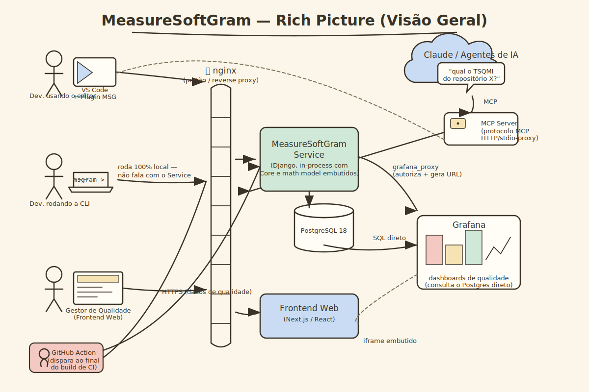
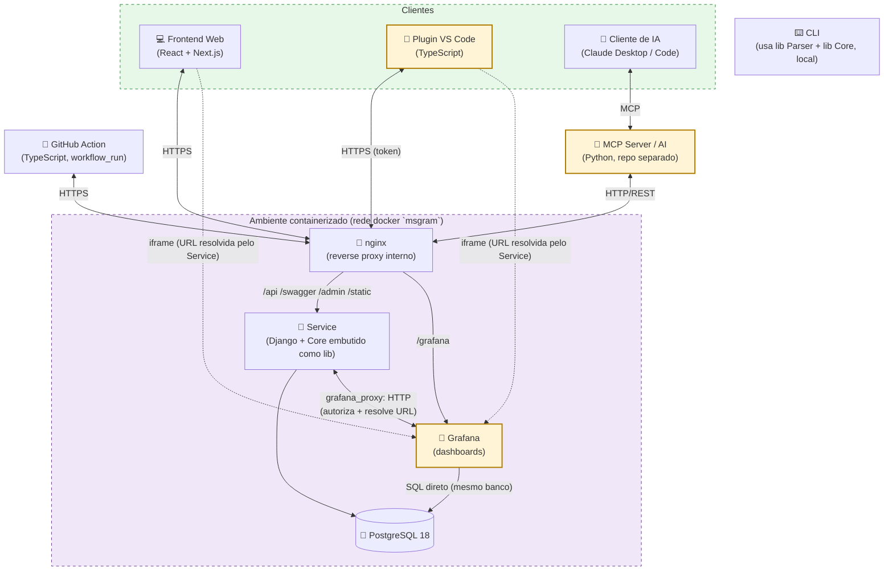
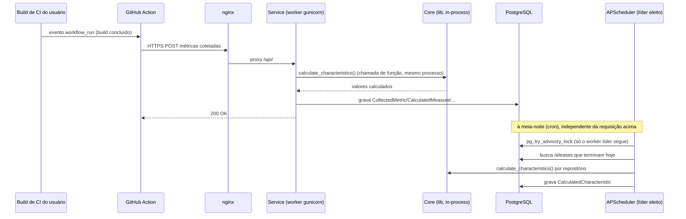

# Documento de Arquitetura

## Introdução

<p align = "justify"> &emsp;&emsp; A finalidade deste documento é apresentar de forma geral os aspectos mais significativos da arquitetura do projeto MeasureSoftwareGram. </p>

<p align = "justify"> &emsp;&emsp; Neste documento são apresentados os seguintes pontos: os serviços e as tecnologias utilizadas em cada parte do projeto, modelo de arquitetura seguido atualmente e as motivações que guiam essas escolhas. </p>

<p align = "justify"> &emsp;&emsp; Através desse documento, é possível obter um melhor entendimento da arquitetura do projeto, permitindo ao leitor a compreensão do funcionamento do sistema e as abordagens utilizadas para o seu desenvolvimento.</p>

### Visão Geral

A arquitetura do projeto está documentada seguindo o modelo **4+1 de Philippe Kruchten**, que organiza a descrição arquitetural em cinco perspectivas complementares:

* **Visão Lógica:** Principais componentes do sistema, suas responsabilidades e como se comunicam;
* **Visão de Processo:** Aspectos de concorrência, distribuição e comunicação entre processos em tempo de execução;
* **Visão de Desenvolvimento:** Organização do código-fonte em módulos e pacotes;
* **Visão Física:** Mapeamento dos componentes de software nos nós de infraestrutura;
* **Visão de Casos de Uso (+1):** Cenários-chave que exercitam e validam as demais visões.

Além das visões arquiteturais, este documento também apresenta o modelo de dados do sistema e as metas e restrições de arquitetura.

#### Rich Picture

<p align = "justify"> &emsp;&emsp; O rich picture abaixo apresenta, de forma informal, o ecossistema do MeasureSoftGram: quem são os atores (desenvolvedores, gestores de qualidade, pipelines de CI e agentes de IA), quais sistemas eles usam e como esses sistemas se conectam. Ele complementa — sem substituir — o diagrama técnico da seção Visão Lógica, mais abaixo, que detalha componentes e protocolos. </p>



<p align = "justify"> &emsp;&emsp; Este desenho é um rascunho produzido internamente pela equipe como ponto de partida; o ideal, como sugerido em revisão, é regerá-lo com apoio de uma ferramenta de geração de imagem por IA para um acabamento mais próximo de um rich picture desenhado à mão. </p>

## Representação de Arquitetura

### Linguagens

- **Python**: Uma linguagem de programação poderosa, flexível e de fácil aprendizado, que é amplamente utilizada devido à sua legibilidade, produtividade e capacidade de integração com outros sistemas. [<a href=./#referencias>1</a>]

- **JavaScript/TypeScript**: Uma linguagem de programação que permite a você implementar itens complexos em páginas web, como conteúdos que se atualiza em um intervalo de tempo, mapas interativos ou gráficos 2D/3D animados, etc. É a terceira camada do bolo das tecnologias padrões da web (HTML, CSS e Javascript). TypeScript por sua vez é uma linguagem de programação fortemente tipada que se baseia em JavaScript, oferecendo melhores ferramentas em qualquer escala. [<a href=./#referencias>2</a>] [<a href=./#referencias>3</a>]

#### Tecnologias

- **React**: Uma biblioteca utilizada para desenvolvimento de interfaces de usuário nativas e web. Essa ferramenta proporciona o desenvolvimento de sites com mais facilidade e rapidez em relação aos tradicionais HTML, CSS e JavaScript. [<a href=./#referencias>4</a>]

- **Next.js**: Um framework de código aberto criado pela Vercel que estende os recursos do React. Com essa ferramenta, é possível usufruir de recursos como geração de páginas estáticas e renderização do lado do servidor, otimizando o desenvolvimento Web. [<a href=./#referencias>5</a>]

- **Django**: Um framework web Python de alto nível que incentiva o desenvolvimento rápido e um design limpo e pragmático. Construído por desenvolvedores experientes, ele cuida de grande parte do incômodo do desenvolvimento da Web, para que você possa se concentrar em escrever seu aplicativo sem precisar reinventar a roda. É gratuito e de código aberto. [<a href=./#referencias>6</a>]

- **Jupyter Notebook**: Um aplicativo baseado na Web para a criação de documentos que combinam código (Python) ao vivo com texto narrativo, equações e visualizações. [<a href=./#referencias>7</a>]

- **PyPI**: O Python Package Index é um repositório para armazenar pacotes de código escritos na linguagem de programação Python. [<a href=./#referencias>8</a>]

#### Gerenciamento de pacotes e runtime

<p align = "justify"> &emsp;&emsp; A partir do semestre 2026.1 o time padronizou o ferramental de runtime e pacotes em todos os repositórios do MSGram. As decisões abaixo estão registradas nos pull requests de modernização da stack Docker do Service (PR <a href="https://github.com/fga-eps-mds/2026.1-MeasureSoftGram-Service/pull/1">#1</a>) e do Front (PR <a href="https://github.com/fga-eps-mds/2026.1-MeasureSoftGram-Front/pull/5">#5</a>). </p>

- **uv**: gerenciador de pacotes Python utilizado no Service, Core, Parser e CLI, em substituição ao pip e ao poetry.
- **pnpm**: gerenciador de pacotes JavaScript utilizado no Front, em substituição ao npm.
- **Python 3.12**: versão fixada nos repositórios em Python, via `pyproject.toml` e imagem Docker oficial.
- **Node 20 LTS**: versão fixada no Front, via `.nvmrc` e imagem Docker oficial.
- **Imagens Docker** com tags fixas (como `python:3.12-slim` ou `postgres:18-alpine`), em vez de `:latest`.
- **Docker Compose v2** com `compose watch`, em substituição ao `docker-compose` v1.

#### Banco de dados

- **PostgreSQL 18**: atualização do PG12/14 herdado para a versão estável mais recente do PostgreSQL, com tag fixada (`postgres:18-alpine`). Registrada no PR de modernização da stack Docker do Service ([#1](https://github.com/fga-eps-mds/2026.1-MeasureSoftGram-Service/pull/1)). [<a href=./#referencias>9</a>]

#### Containers e imagens (estrutura evoluída)

<p align = "justify"> &emsp;&emsp; O Service evoluiu de um único container Django+Postgres para uma stack com cinco containers, orquestrados por dois arquivos <code>docker compose</code> distintos: um para desenvolvimento (raiz do repositório) e um para produção (<code>deploy/docker-compose.prod.yml</code>). </p>

| Container | Imagem (dev) | Imagem (produção) | Observações |
| :--- | :--- | :--- | :--- |
| `db` | `postgres:18-alpine` | `postgres:18-alpine` | volume nomeado `service_postgres_data`; publica `5432` só em `127.0.0.1` no dev, sem publicar porta em produção |
| `service` | build local (`Dockerfile` multi-stage: builder com `uv` + runtime `python:3.12-slim-bookworm`) | `${DOCKERHUB_USERNAME}/service:${SERVICE_IMAGE_TAG}` (pull do DockerHub, buildada no CI) | `compose watch` sincroniza `./src` em dev; produção só puxa a imagem, não builda |
| `front` | build local (`node:20-alpine`, `pnpm`) | `${DOCKERHUB_USERNAME}/front:${FRONT_IMAGE_TAG}` | variáveis `SERVICE_URL`, `GITHUB_CLIENT_ID` etc. entram como build-arg no CI |
| `grafana` | `grafana/grafana:latest` | `grafana/grafana:latest` | plugin `volkovlabs-echarts-panel`; volume nomeado `grafana_data`; provisionamento via bind mount de `grafana/provisioning` e `grafana/dashboards` |
| `proxy` | — (só existe em produção) | `nginx:1.27-alpine` | único container que publica porta no host (`80:80`); ver seção "Nginx e Grafana" logo abaixo |

<p align = "justify"> &emsp;&emsp; Todos os containers (exceto o proxy) ficam em uma rede <code>bridge</code> própria chamada <code>msgram</code>, isolada do host — <code>db</code> e <code>service</code> não publicam porta nenhuma em produção, só são alcançáveis pelos outros containers da mesma rede. Healthchecks (<code>pg_isready</code> no banco, <code>curl</code> no <code>/swagger/</code> do Service) controlam a ordem de subida via <code>depends_on: condition: service_healthy</code>. Segredos (tokens, senhas de banco e do Grafana) vivem em arquivos <code>.env</code> dentro de <code>deploy/env-vars/</code>, nunca versionados no repositório. </p>

#### Nginx e Grafana (integração)

<p align = "justify"> &emsp;&emsp; Em produção existe um proxy nginx <strong>interno</strong> à stack (container <code>proxy</code>, imagem <code>nginx:1.27-alpine</code>), que fica atrás de um proxy <strong>externo</strong> da máquina (openresty, fora do escopo deste compose) responsável por terminar o domínio e o TLS. O nginx interno publica a porta <code>80</code> do host e roteia por caminho: </p>

| Rota | Destino | Observação |
| :--- | :--- | :--- |
| `/api/`, `/swagger/`, `/admin/`, `/static/` | `service:8080` | backend Django (DRF) |
| `/grafana/` | `grafana:3000` | com upgrade de conexão para WebSocket (necessário para o Grafana Live) |
| `/` | `front:3000` | frontend Next.js |

<p align = "justify"> &emsp;&emsp; O Grafana roda como container independente do ciclo de vida do Django, com dashboards de qualidade provisionados automaticamente a partir de arquivos JSON (<code>grafana/dashboards/*.json</code>) e um datasource Postgres que consulta <strong>diretamente</strong> o mesmo banco do Service — sem passar pela API REST. Para permitir a incorporação via <code>iframe</code> no Frontend e no Plugin VS Code, o Grafana é configurado com acesso anônimo somente-leitura (<code>GF_AUTH_ANONYMOUS_ENABLED</code>, papel <code>Viewer</code>) e <code>GF_SECURITY_ALLOW_EMBEDDING=true</code>. </p>

<p align = "justify"> &emsp;&emsp; Como o Grafana fica aberto para leitura anônima, o controle de acesso por produto/repositório é feito no lado do Service, por um app Django dedicado, o <code>grafana_proxy</code>. Ele expõe dois endpoints autenticados: </p>

- `GET /api/v1/grafana/dashboards/` — lista os dashboards disponíveis;
- `GET /api/v1/grafana/dashboard/{uid}/?product_id=...&repository_id=...` — valida se o usuário tem permissão sobre aquele produto/repositório (`CanAccessProduct`, `CanAccessDashboard`) e devolve a URL pública do dashboard já filtrada, pronta para ser usada como `src` do `iframe`.

<p align = "justify"> &emsp;&emsp; Ou seja: o Frontend e o Plugin VS Code nunca chamam o Grafana diretamente para autorização — sempre pedem a URL ao <code>grafana_proxy</code> do Service, e só então carregam essa URL num <code>iframe</code>. </p>

#### Serviços

- **CLI** Abreviação de "interface de linha de comando". Este é um programa que permite aos usuários criar comandos para funções específicas passando instruções para o computador.

- **Frontend Web** Esta é a aplicação interface web que permite aos usuários analisar e acompanhar os produtos pelo navegador.

- **Service** Este é o programa responsável por se comunicar com a aplicação `Frontend Web` e fornecer todos os dados necessários para a aplicação web.

- **Parser** Este repositório possui a capacidade de interpretar a estrutura gramatical ou sintática dos dados de entrada, a fim de transformá-los em uma representação interna mais adequada para processamento pelos demais serviços.

- **Github Action** Action customizada do Github que permite realizar a análise de um certo repositorio. Esta aplicação é responsável por se comunicar com o serviço `Service` e fornecer todos os dados necessários para a aplicação web.

- **MCP Server** Servidor que expõe o MeasureSoftGram a clientes de inteligência artificial (como Claude Desktop e Claude Code) por meio do protocolo MCP. Comunica-se com o `Service` via HTTP e fica em repositório separado.

---

## Visões Arquiteturais (4+1)

### Visão Lógica

<p align = "justify"> &emsp;&emsp; A visão lógica descreve os principais componentes do sistema, suas responsabilidades e como se comunicam entre si. O diagrama abaixo apresenta os componentes do MeasureSoftGram, as tecnologias utilizadas em cada um e as relações entre eles. </p>

<p align = "justify"> &emsp;&emsp; <strong>Nota de correção:</strong> em versões anteriores este diagrama mostrava <code>Core</code> e <code>Parser</code> como serviços de rede conectados ao <code>Service</code> via HTTP. Isso não reflete o código real: <code>Core</code> (<code>msgram_core</code>) é importado como <strong>biblioteca Python dentro do próprio processo do Service</strong>, e <code>Parser</code> (<code>msgram-parser</code>) é uma biblioteca consumida apenas pela <code>CLI</code> — nenhum dos dois roda como processo de rede próprio. A CLI, por sua vez, não chama o Service pela rede: ela calcula e grava os resultados localmente. </p>



---

### Visão de Processo

<p align = "justify"> &emsp;&emsp; Esta visão descreve os aspectos de concorrência, distribuição e comunicação entre processos em tempo de execução. O MeasureSoftGram <strong>não usa fila de mensagens nem broker</strong> (não há Celery, Redis ou RabbitMQ na stack) — a comunicação entre os processos de rede é majoritariamente síncrona (request/response), e a única concorrência existente roda dentro do próprio processo do Service. </p>

#### Processos de longa duração (sempre ativos)

| Processo | Natureza | Comunicação |
| :--- | :--- | :--- |
| `Service` (gunicorn, WSGI síncrono) | Múltiplos workers (`GUNICORN_WORKERS`, padrão 3), modelo *prefork* — cada worker é um processo OS separado | HTTP/REST, síncrono |
| `Grafana` | Container independente, ciclo de vida próprio | Consulta o PostgreSQL diretamente via SQL; conversa com o Service via `grafana_proxy` (HTTP) só para autorização |
| `MCP Server (AI)` | Container HTTP de longa duração, repositório separado | Recebe chamadas MCP do agente de IA e as traduz em chamadas HTTP síncronas ao Service |

#### Concorrência dentro do Service (in-process, sem fila)

<p align = "justify"> &emsp;&emsp; Existem exatamente dois mecanismos de concorrência, ambos internos ao processo Django — não há execução distribuída: </p>

1. **Job agendado diário (APScheduler).** O app `releases` registra, no boot de cada worker (`AppConfig.ready()`), um `BackgroundScheduler` do `django-apscheduler` que roda `get_releases_and_create_results` todo dia à meia-noite (`America/Sao_Paulo`), calculando as características das releases que terminam naquele dia. Como o gunicorn sobe múltiplos workers (processos separados), cada um tentaria iniciar seu próprio agendador — para evitar duplicação, o primeiro worker a conseguir um **advisory lock do Postgres** (`pg_try_advisory_lock`) vira o "líder" e é o único que efetivamente agenda o job; os demais detectam o lock ocupado e não agendam nada.
2. **Thread "fire-and-forget" na criação de repositório.** Ao cadastrar um repositório pela API, o Service dispara uma `threading.Thread` (`daemon=True`) que tenta acionar o workflow de GitHub Actions do próprio usuário (via GitHub API, com o token OAuth armazenado) e, se isso falhar, gera dados de qualidade sintéticos localmente para a interface não ficar vazia. Não há fila, persistência do job nem retentativa: se o worker reiniciar no meio da execução, a thread é perdida silenciosamente.



#### Processos efêmeros / orientados a evento

- **GitHub Action**: cada execução é um runner novo (hospedado no GitHub ou simulado localmente via `nektos/act`, usado pelo Plugin VS Code), que sobe, roda e termina — disparado pelo evento `workflow_run` ao final do build do usuário.
- **CLI**: comando único que roda até concluir e encerra; não abre conexão de rede com o Service (usa as bibliotecas Parser e Core localmente e grava o resultado em arquivo).

---

### Visão de Desenvolvimento

<p align = "justify"> &emsp;&emsp; A visão de desenvolvimento apresenta a organização do código-fonte em módulos e pacotes para cada repositório do projeto. </p>

#### Web


#### Core


#### CLI


#### Parser


#### Action


#### Grafana

<p align = "justify"> &emsp;&emsp; O Grafana não é um pacote de código do MeasureSoftGram — é uma ferramenta de terceiros provisionada por arquivos de configuração. Por isso, em vez de um diagrama de pacotes, documentamos a estrutura de provisionamento (dentro do repositório do Service): </p>

```
grafana/
├── dashboards/                        # dashboards provisionados (JSON)
│   ├── dashboard-visao-geral.json
│   ├── dashboard-evolucao.json
│   ├── dashboard-ecg-tsqmi.json
│   └── dashboard-saude-qualidade-repositorio.json
├── provisioning/
│   ├── datasources/measuresoftgram.yml   # datasource Postgres (aponta pro mesmo banco do Service)
│   └── dashboards/provider.yml           # provider que carrega os JSONs acima automaticamente
└── seed_planejado_vs_realizado.sql       # dados de apoio para os dashboards
```

---

### Visão Física

<p align = "justify"> &emsp;&emsp; Um diagrama de implantação especifica os construtos que podem ser usados para definir a arquitetura de execução de sistemas e a atribuição de artefatos de software aos elementos do sistema. Para descrever um site, por exemplo, um diagrama de implantação mostraria quais componentes de hardware ("nós") existem (por exemplo, um servidor web, um servidor de aplicação e um servidor de banco de dados), quais componentes de software ("artefatos") rodam em cada nó e como as diferentes peças estão conectadas. </p>

Os nós aparecem como caixas tridimensionais, e os componentes alocados a cada nó aparecem como retângulos dentro das caixas. Os nós podem ter subnós, que aparecem como caixas aninhadas. Um único nó em um diagrama de implantação pode representar conceitualmente vários nós físicos, como um cluster de servidores de banco de dados.

Existem dois tipos de nós:

- **Nó de Dispositivo (device)**
- **Nó de Ambiente de Execução (execution environment)**

Os nós de dispositivo são recursos físicos de computação com memória de processamento e serviços para executar software, como computadores típicos ou telefones celulares. Um nó de ambiente de execução é um recurso de computação de software que roda dentro de um nó externo e que, por sua vez, fornece um serviço para hospedar e executar outros elementos de software executáveis.


---

### Visão de Casos de Uso

!!! warning "Em elaboração"
    Esta visão apresentará os cenários-chave que exercitam e validam as demais visões arquiteturais. Será detalhada nas próximas releases.

---

## Modelo de Dados

### Modelo Entidade-Relacionamento (MER)

<p align = "justify"> &emsp;&emsp; O MER textual descreve as entidades, seus atributos e os relacionamentos com cardinalidades do banco de dados do MeasureSoftGram Service. O símbolo <code>#</code> antes de um atributo indica que ele é <strong>opcional (nullable)</strong> — corresponde a campos declarados com <code>null=True, blank=True</code> no Django. </p>

#### Entidades

```
CUSTOM_USER
ORGANIZATION
PRODUCT
REPOSITORY
SUPPORTED_METRIC
COLLECTED_METRIC
SUPPORTED_MEASURE
CALCULATED_MEASURE
SUPPORTED_SUBCHARACTERISTIC
CALCULATED_SUBCHARACTERISTIC
SUPPORTED_CHARACTERISTIC
CALCULATED_CHARACTERISTIC
BALANCE_MATRIX
TSQMI
GOAL
RELEASE
RELEASE_CONFIGURATION
```

#### Atributos

```
CUSTOM_USER(
id [PK], username, email, # first_name, # last_name,
password, is_staff, is_active, date_joined)

ORGANIZATION(
id [PK], name, key, # description,
admin [FK -> CUSTOM_USER])

PRODUCT(
id [PK], name, key, # description,
gaugeRedLimit, gaugeYellowLimit,
organization [FK -> ORGANIZATION])

REPOSITORY(
id [PK], name, key, # url, # platform, # description, imported,
product [FK -> PRODUCT])

SUPPORTED_METRIC(
id [PK], key, name, metric_type, # description)

COLLECTED_METRIC(
id [PK], value, created_at,
# path, # qualifier, # dynamic_key,
metric [FK -> SUPPORTED_METRIC],
repository [FK -> REPOSITORY])

SUPPORTED_MEASURE(
id [PK], key, name, # description)

CALCULATED_MEASURE(
id [PK], value, created_at,
measure [FK -> SUPPORTED_MEASURE],
repository [FK -> REPOSITORY])

SUPPORTED_SUBCHARACTERISTIC(
id [PK], key, name, # description)

CALCULATED_SUBCHARACTERISTIC(
id [PK], value, created_at,
subcharacteristic [FK -> SUPPORTED_SUBCHARACTERISTIC],
repository [FK -> REPOSITORY])

SUPPORTED_CHARACTERISTIC(
id [PK], key, name, # description)

CALCULATED_CHARACTERISTIC(
id [PK], value, created_at,
characteristic [FK -> SUPPORTED_CHARACTERISTIC],
repository [FK -> REPOSITORY],
# release [FK -> RELEASE])

BALANCE_MATRIX(
id [PK], relation_type,
source_characteristic [FK -> SUPPORTED_CHARACTERISTIC],
target_characteristic [FK -> SUPPORTED_CHARACTERISTIC])

TSQMI(
id [PK], value, created_at,
repository [FK -> REPOSITORY])

GOAL(
id [PK], data, created_at,
created_by [FK -> CUSTOM_USER],
product [FK -> PRODUCT])

RELEASE(
id [PK], release_name, start_at, end_at, created_at, # description,
created_by [FK -> CUSTOM_USER],
product [FK -> PRODUCT],
goal [FK -> GOAL])

RELEASE_CONFIGURATION(
id [PK], # name, data, created_at,
product [FK -> PRODUCT])
```

#### Relacionamentos

```
CUSTOM_USER - é_membro_de - ORGANIZATION
   - Descrição: Um usuário pode ser membro de várias organizações, e uma organização pode ter vários membros.
   - Cardinalidade: (N,M)

CUSTOM_USER - administra - ORGANIZATION
   - Descrição: Um usuário pode administrar várias organizações, mas cada organização possui no máximo um administrador.
   - Cardinalidade: (1,N)

ORGANIZATION - possui - PRODUCT
   - Descrição: Uma organização pode possuir vários produtos, e cada produto pertence a uma única organização.
   - Cardinalidade: (1,N)

PRODUCT - possui - REPOSITORY
   - Descrição: Um produto pode possuir vários repositórios, e cada repositório pertence a um único produto.
   - Cardinalidade: (1,N)

PRODUCT - possui - RELEASE_CONFIGURATION
   - Descrição: Um produto pode ter várias configurações de release ao longo do tempo, e cada configuração pertence a um único produto.
   - Cardinalidade: (1,N)

PRODUCT - possui - GOAL
   - Descrição: Um produto pode ter vários objetivos de qualidade definidos, e cada goal pertence a um único produto.
   - Cardinalidade: (1,N)

PRODUCT - possui - RELEASE
   - Descrição: Um produto pode ter várias releases, e cada release pertence a um único produto.
   - Cardinalidade: (1,N)

CUSTOM_USER - cria - GOAL
   - Descrição: Um usuário pode criar vários goals, e cada goal é criado por um único usuário.
   - Cardinalidade: (1,N)

CUSTOM_USER - cria - RELEASE
   - Descrição: Um usuário pode criar várias releases, e cada release é criada por um único usuário.
   - Cardinalidade: (1,N)

GOAL - referenciado_em - RELEASE
   - Descrição: Um goal pode ser referenciado por várias releases, e cada release referencia um único goal.
   - Cardinalidade: (1,N)

SUPPORTED_METRIC - compoe - SUPPORTED_MEASURE
   - Descrição: Uma métrica suportada pode compor várias medidas, e uma medida pode ser composta por várias métricas.
   - Cardinalidade: (N,M)

SUPPORTED_METRIC - origina - COLLECTED_METRIC
   - Descrição: Uma métrica suportada pode originar vários registros coletados ao longo do tempo.
   - Cardinalidade: (1,N)

REPOSITORY - armazena - COLLECTED_METRIC
   - Descrição: Um repositório pode armazenar vários registros de métricas coletadas ao longo do tempo.
   - Cardinalidade: (1,N)

SUPPORTED_MEASURE - compoe - SUPPORTED_SUBCHARACTERISTIC
   - Descrição: Uma medida suportada pode compor várias subcaracterísticas, e uma subcaracterística pode ser composta por várias medidas.
   - Cardinalidade: (N,M)

SUPPORTED_MEASURE - origina - CALCULATED_MEASURE
   - Descrição: Uma medida suportada pode originar vários registros de valores calculados ao longo do tempo.
   - Cardinalidade: (1,N)

REPOSITORY - armazena - CALCULATED_MEASURE
   - Descrição: Um repositório pode armazenar vários registros de medidas calculadas ao longo do tempo.
   - Cardinalidade: (1,N)

SUPPORTED_SUBCHARACTERISTIC - compoe - SUPPORTED_CHARACTERISTIC
   - Descrição: Uma subcaracterística suportada pode compor várias características, e uma característica pode agrupar várias subcaracterísticas.
   - Cardinalidade: (N,M)

SUPPORTED_SUBCHARACTERISTIC - origina - CALCULATED_SUBCHARACTERISTIC
   - Descrição: Uma subcaracterística suportada pode originar vários registros de valores calculados ao longo do tempo.
   - Cardinalidade: (1,N)

REPOSITORY - armazena - CALCULATED_SUBCHARACTERISTIC
   - Descrição: Um repositório pode armazenar vários registros de subcaracterísticas calculadas ao longo do tempo.
   - Cardinalidade: (1,N)

SUPPORTED_CHARACTERISTIC - origina - CALCULATED_CHARACTERISTIC
   - Descrição: Uma característica suportada pode originar vários registros de valores calculados ao longo do tempo.
   - Cardinalidade: (1,N)

REPOSITORY - armazena - CALCULATED_CHARACTERISTIC
   - Descrição: Um repositório pode armazenar vários registros de características calculadas ao longo do tempo.
   - Cardinalidade: (1,N)

RELEASE - associada_a - CALCULATED_CHARACTERISTIC
   - Descrição: Uma release pode estar associada a vários registros de características calculadas. A associação é opcional (release pode ser nula).
   - Cardinalidade: (1,N)

SUPPORTED_CHARACTERISTIC - relaciona_se_com - SUPPORTED_CHARACTERISTIC
   - Descrição: Uma característica pode se relacionar com várias outras através da BALANCE_MATRIX, e pode ser impactada por várias outras (auto-relacionamento com atributo relation_type: + positivo / - negativo).
   - Cardinalidade: (N,M)

REPOSITORY - armazena - TSQMI
   - Descrição: Um repositório pode acumular vários registros de nota TSQMI ao longo do tempo.
   - Cardinalidade: (1,N)
```

### Diagrama Entidade-Relacionamento (DER)

<p align = "justify"> &emsp;&emsp; Um Diagrama Entidade-Relacionamento (DER) é uma representação gráfica que descreve as entidades, os relacionamentos e as conexões entre elas em um sistema ou domínio específico. É uma ferramenta fundamental utilizada no projeto de bancos de dados e sistemas de informação para modelar e visualizar a estrutura e interações entre os elementos essenciais de um sistema. </p>

<p align = "justify"> &emsp;&emsp; O Diagrama Entidade-Relacionamento do projeto MeasureSoftGram foi criado automaticamente utilizando a coleção do <em>django-extensions</em>, usando o comando <em>graph-models</em>: </p>


### Diagrama Lógico de Dados (DLD)

!!! warning "Em elaboração"
    O DLD — representando as tabelas, colunas, tipos e chaves do banco de dados — será adicionado em atualização futura.

---

## Metas e Restrições de Arquitetura

### Metas

|     Metas      |                                                                           |
| :------------: | :-----------------------------------------------------------------------: |
| Escalabilidade | A aplicação deverá ser escalável                                          |
|   Segurança    | A aplicação deverá tratar de forma segura os dados sensíveis dos usuários |
|     Deploy     | A aplicação deverá possuir deploy automatizado                            |
|     Usabilidade     | A aplicação deverá ter uma boa usabilidade para o usuário                           |

### Restrições

| Restrições    |                                                                                                                  |
| :-----------: | :--------------------------------------------------------------------------------------------------------------: |
| Conectividade | Para utilização do <b>Frontend</b> é preciso ter conexão com a internet. Para utilizar o <b>CLI</b> isso será necessário apenas para extrações do GitHub, e não para o Sonarqube |
|  Plataforma   | A aplicação possuirá suporte WEB e para linha de comando                                                         |
|    Público    | A aplicação será desenvolvida com foco em empresas de tecnologia e desenvolvedores                               |
|   Linguagem   | O inglês foi escolhido por conta das integrações com plataformas que já utilizam essa linguagem                  |
|    Equipe     | A equipe possui 10 integrantes                                                                                   |
|     Prazo     | O prazo é até o final do semestre 2026.1 da Universidade de Brasília                                            |

---

## Referências

> [1] <b>What is Python? Executive Summary</b>. Disponível em: < [https://www.python.org/doc/essays/blurb/](https://www.python.org/doc/essays/blurb/) > Acesso em: 4 de Outubro de 2023

> [2] <b>O que é JavaScript?</b>. Disponível em: < [https://developer.mozilla.org/pt-BR/docs/Learn/JavaScript/First_steps/What_is_JavaScript](https://developer.mozilla.org/pt-BR/docs/Learn/JavaScript/First_steps/What_is_JavaScript) > Acesso em: 4 de Outubro de 2023

> [3] <b>TypeScript is JavaScript with syntax for types</b>. Disponível em: < [https://www.typescriptlang.org](https://www.typescriptlang.org) > Acesso em: 4 de Outubro de 2023

> [4] <b>React</b>. Disponível em: < [https://react.dev](https://react.dev) > Acesso em: 4 de Outubro de 2023

> [5] <b>What is Next.js?</b>. Disponível em: < [https://nextjs.org/learn/foundations/about-nextjs/what-is-nextjs](https://nextjs.org/learn/foundations/about-nextjs/what-is-nextjs) > Acesso em: 4 de Outubro de 2023

> [6] <b>Django</b>. Disponível em: < [https://www.djangoproject.com](https://www.djangoproject.com) > Acesso em: 4 de Outubro de 2023

> [7] <b>The Jupyter Notebook</b>. Disponível em: < [https://jupyter-notebook.readthedocs.io/en/latest/notebook.html](https://jupyter-notebook.readthedocs.io/en/latest/notebook.html) > Acesso em: 4 de Outubro de 2023

> [8] <b>PyPI - Python Package Index</b>. Disponível em: < [https://pypi.org](https://pypi.org) > Acesso em: 4 de Outubro de 2023

> [9] <b>PostgreSQL: The World's Most Advanced Open Source Relational Database</b>. Disponível em: < [https://www.postgresql.org](https://www.postgresql.org) > Acesso em: 4 de Outubro de 2023

> <b>Tudo sobre diagramas de pacotes UML</b>. Disponível em: < [https://www.lucidchart.com/pages/pt/diagrama-de-pacotes-uml](https://www.lucidchart.com/pages/pt/diagrama-de-pacotes-uml) > Acesso em: 4 de Outubro de 2023

> <b>Arquitetura do Sistema (MeasureSoftGram-2023-1)</b>. Disponível em: < [https://fga-eps-mds.github.io/2023-1-MeasureSoftGram-Doc/documentos_de_projeto/arquitetura_do_projeto](https://fga-eps-mds.github.io/2023-1-MeasureSoftGram-Doc/documentos_de_projeto/arquitetura_do_projeto) > Acesso em: 4 de Outubro de 2023

> <b>Architectural Blueprints — The "4+1" View Model of Software Architecture</b>. Kruchten, Philippe. IEEE Software, 1995. Disponível em: < [https://www.cs.ubc.ca/~gregor/teaching/papers/4+1view-architecture.pdf](https://www.cs.ubc.ca/~gregor/teaching/papers/4+1view-architecture.pdf) >

---

## Versionamento

|Data|Autor|Descrição|Versão|
|:--:|:--:|:---:|:---:|
|01/08/2024| Gabriel Moretti | Adicionando documento |1.0|
|13/09/2024| Christian Siqueira | Atualizando o diagrama de banco de dados |1.1|
|13/09/2024| Christian Siqueira | Adicionando diagrama de implantação |1.2|
|13/09/2024| Christian Siqueira | Atualizando o diagrama de arquitetura|1.3|
|27/04/2026| Giovanni A. C. Giampauli | Revisão R1 2026.1: registra decisões de stack do semestre — PostgreSQL 18, uv (Python), pnpm (JS), Python 3.12, Node 20 LTS, versões pinadas no Docker, Compose v2 com `compose watch`. Diagramas permanecem vigentes (sem mudança topológica). |1.4|
|03/05/2026| Giovanni A. C. Giampauli | Adiciona MCP Server e migra diagrama arquitetural para Mermaid. |1.5|
|09/06/2026| Anacleto | Reestrutura documento com modelo de visões 4+1 (Kruchten). Adiciona placeholders para Visão de Processo, Visão de Casos de Uso, MER e DLD. Corrige prazo para 2026.1. |1.6|
|09/06/2026| Anacleto | Preenche seção MER com entidades, atributos e relacionamentos do Service. |1.7|
