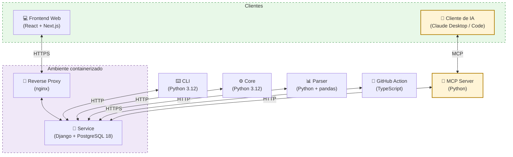

# Documento de Arquitetura

## Introdução

 &emsp;&emsp; A finalidade este documento é apresentar de forma geral os aspectos mais significativos da arquitetura do projeto MeasureSoftwareGram. 

 &emsp;&emsp; Neste documento são apresentados os seguintes pontos: os serviços e as tecnologias utilizadas em cada parte do projeto, modelo de arquitetura seguido atualmente e as motivações que guiam essas escolhas. 

 &emsp;&emsp; Através desse documento, é possível obter um melhor entendimento da arquitetura do projeto, permitindo ao leitor a compreensão do funcionamento do sistema e as abordagens utilizadas para o seu desenvolvimento.

### Visão Geral

* Introdução: Apresenta uma visão geral sobre o conteúdo dessa documentação;
* Representação de Arquitetura: Descreve os serviços, tecnologias e os padrões de arquitetura utilizados e informa as razões que motivaram tais escolhas;
* Metas e Restrições de Arquitetura: Fala sobre objetivos que buscam ser alcançados dentro da arquitetura escolhida;
* Referências: Emprega as fontes utilizadas nas pesquisas para relacionar as publicações que foram consultadas e citadas.

## Representação de Arquitetura

### Linguagens

- **Python**: Uma linguagem de programação poderosa, flexível e de fácil aprendizado, que é amplamente utilizada devido à sua legibilidade, produtividade e capacidade de integração com outros sistemas. [<a href=./#referencia>1</a>]

- **JavaScript/TypeScript**: Uma linguagem de programação que permite a você implementar itens complexos em páginas web, como conteúdos que se atualiza em um intervalo de tempo, mapas interativos ou gráficos 2D/3D animados, etc. É a terceira camada do bolo das tecnologias padrões da web (HTML, CSS e Javascript). TypeScript por sua vez é uma linguagem de programação fortemente tipada que se baseia em JavaScript, oferecendo melhores ferramentas em qualquer escala. [<a href=./#referencia>2</a>] [<a href=./#referencia>3</a>]

#### Tecnologias

- **React**: Uma biblioteca utilizada para desenvolvimento de interfaces de usuário nativas e web. Essa ferramenta proporciona o desenvolvimento de sites com mais facilidade e rapidez em relação aos tradicionais HTML, CSS e JavaScript. [<a href=./#referencia>4</a>]

- **Next.js**: Um framework de código aberto criado pela Vercel que estende os recursos do React. Com essa ferramenta, é possível usufruir de recursos como geração de páginas estáticas e renderização do lado do servidor, otimizando o desenvolvimento Web. [<a href=./#referencia>5</a>]

- **Django**: Um framework web Python de alto nível que incentiva o desenvolvimento rápido e um design limpo e pragmático. Construído por desenvolvedores experientes, ele cuida de grande parte do incômodo do desenvolvimento da Web, para que você possa se concentrar em escrever seu aplicativo sem precisar reinventar a roda. É gratuito e de código aberto. [<a href=./#referencia>6</a>]

- **Jupyter Notebook**: Um aplicativo baseado na Web para a criação de documentos que combinam código (Python) ao vivo com texto narrativo, equações e visualizações. [<a href=./#referencia>7</a>]

- **PyPI**: O Python Package Index é um repositório para armazenar pacotes de código escritos na linguagem de programação Python. [<a href=./#referencia>8</a>]

#### Gerenciamento de pacotes e runtime (decisão R1 2026.1)

A partir do semestre 2026.1 padronizamos o ferramental de runtime e pacotes em todos os repositórios do MSGram. As decisões abaixo estão registradas nos PRs de modernização da stack Docker (Service [#1](https://github.com/fga-eps-mds/2026.1-MeasureSoftGram-Service/pull/1) e Front [#5](https://github.com/fga-eps-mds/2026.1-MeasureSoftGram-Front/pull/5), ambos *merged*):

- **uv** — gerenciador único de pacotes Python (Service, Core, Parser, CLI). Substitui pip/pipenv/poetry. Lockfile reprodutível e instalação ~10× mais rápida em CI.
- **pnpm** — gerenciador de pacotes JavaScript no Front. Substitui npm/yarn. Cache global por content-hash reduz tempo de build e disco.
- **Python 3.12** — versão fixada nos repos Python (Service, Core, Parser, CLI), via `pyproject.toml` e imagem Docker oficial.
- **Node 20 LTS** — versão fixada no Front, via `.nvmrc` e imagem Docker oficial.
- **Versões pinadas em todas as imagens Docker** — sem `:latest`. Cada `Dockerfile` e `docker-compose.yml` referencia tag explícita (ex.: `python:3.12-slim`, `node:20-alpine`, `postgres:18-alpine`). Decisão tomada para garantir reprodutibilidade entre desenvolvimento, CI e homologação.
- **Docker Compose v2 com `compose watch`** — substitui o antigo `docker-compose` v1. Hot reload nativo durante desenvolvimento.

#### Banco de dados

- **PostgreSQL 18** (decisão R1 2026.1): atualização do PG12/14 herdado para a versão estável mais recente do PostgreSQL, com tag fixada (`postgres:18-alpine`). Decisão registrada no PR de modernização da stack Docker do Service ([#1](https://github.com/fga-eps-mds/2026.1-MeasureSoftGram-Service/pull/1)). [<a href=./#referencia>9</a>]

#### Serviços

- **CLI** Abreviação de "interface de linha de comando". Este é um programa que permite aos usuários criar comandos para funções específicas passando instruções para o computador.

- **Frontend Web** Esta é a aplicação interface web que permite aos usuários analisar e acompanhar os produtos pelo navegador. 

- **Service** Este é o programa responsável por se comunicar com a aplicação `Frontend Web` e fornecer todos os dados necessários para a aplicação web.

- **Parser** Este repositório possui a capacidade de interpretar a estrutura gramatical ou sintática dos dados de entrada, a fim de transformá-los em uma representação interna mais adequada para processamento pelos demais serviços.

- **Github Action** Action customizada do Github que permite realizar a análise de um certo repositorio. Esta aplicação é responsável por se comunicar com o serviço `Service` e fornecer todos os dados necessários para a aplicação web.

- **MCP Server** Servidor que conecta clientes de inteligência artificial (como o Claude Desktop e o Claude Code) ao MeasureSoftGram. Por meio dele, o usuário consulta os indicadores de qualidade do software em uma conversa com a IA, sem precisar abrir a interface web ou rodar a CLI. Comunica-se com o `Service` por HTTP e fica em um repositório separado.

## Diagrama Arquitetural

*Diagrama mantido em [Mermaid](https://mermaid.js.org), versionado em texto neste arquivo. Para editar, basta alterar o bloco acima.*

## Diagrama de Implantação
Um diagrama de implantação especifica os construtos que podem ser usados para definir a arquitetura de execução de sistemas e a atribuição de artefatos de software aos elementos do sistema.Para descrever um site, por exemplo, um diagrama de implantação mostraria quais componentes de hardware ("nós") existem (por exemplo, um servidor web, um servidor de aplicação e um servidor de banco de dados), quais componentes de software ("artefatos") rodam em cada nó (por exemplo, aplicação web, banco de dados) e como as diferentes peças estão conectadas (por exemplo, HTTP, GRPC).

Os nós aparecem como caixas tridimensionais, e os componentes alocados a cada nó aparecem como retângulos dentro das caixas. Os nós podem ter subnós, que aparecem como caixas aninhadas. Um único nó em um diagrama de implantação pode representar conceitualmente vários nós físicos, como um cluster de servidores de banco de dados.

Existem dois tipos de nós:

- **Nó de Dispositivo (device)** 
- **Nó de Ambiente de Execução (execution environment)**

Os nós de dispositivo são recursos físicos de computação com memória de processamento e serviços para executar software, como computadores típicos ou telefones celulares. Um nó de ambiente de execução é um recurso de computação de software que roda dentro de um nó externo e que, por sua vez, fornece um serviço para hospedar e executar outros elementos de software executáveis.

## Diagrama de Pacotes

### Web

### Core

### CLI

### Parser

### Action

## Metas e Restrições de Arquitetura

### Metas

|     Metas      |                                                                           |
| :------------: | :-----------------------------------------------------------------------: |
| Escalabilidade | A aplicação deverá ser escalável                                          |
|   Segurança    | A aplicação deverá tratar de forma segura os dados sensíveis dos usuários |
|     Deploy     | A aplicação deverá possuir deploy automatizado                            |
|     Usabilidade     | A aplicação deverá ter uma boa usabilidade para o usuário                           |

### Restrições

| Restrições    |                                                                                                                  |
| :-----------: | :--------------------------------------------------------------------------------------------------------------: |
| Conectividade | Para utilização do <b>Frontend</b> é preciso ter conexão com a internet. Para utilizar o <b>CLI</b> isso será necessário apenas para extrações do GitHub, e não para o Sonarqube |
|  Plataforma   | A aplicação possuirá suporte WEB e para linha de comando                                                         |
|    Público    | A aplicação será desenvolvida com foco em empresas de tecnologia e desenvolvedores                               |
|   Linguagem   | O inglês foi escolhido por conta das integrações com plataformas que já utilizam essa linguagem                  |
|    Equipe     | A equipe possui 10 integrantes                                                                                   |
|     Prazo     | O prazo é até o final do semestre 2024.1 (29/09/2024) da Universidade de Brasília                                |

## Diagrama Entidade-Relacionamento

### Introdução

 &emsp;&emsp; Um Diagrama Entidade-Relacionamento (DER) é uma representação gráfica que descreve as entidades, os relacionamentos e as conexões entre elas em um sistema ou domínio específico. É uma ferramenta fundamental utilizada no projeto de bancos de dados e sistemas de informação para modelar e visualizar a estrutura e interações entre os elementos essenciais de um sistema. 

 &emsp;&emsp; No cerne de um DER estão as entidades, que são objetos do mundo real ou conceitual que possuem atributos e características distintas. Os relacionamentos indicam as interações e conexões entre essas entidades, proporcionando uma compreensão clara dos fluxos de dados e informações dentro de um sistema. O DER não apenas representa as entidades e seus relacionamentos, mas também os atributos associados a cada entidade e como esses atributos se relacionam entre si. Essa representação gráfica facilita a comunicação entre as partes interessadas, permitindo uma compreensão abrangente e uma base sólida para o desenvolvimento e otimização do sistema. 

 &emsp;&emsp; O Diagrama Entidade-Relacionamento do projeto MeasureSoftGram foi criado automaticamente utilizando a coleção do *django-extensions*, usando o comando *graph-models*, essa ferramenta cria um diagrama do banco de dados da aplicação, como a imagem abaixo: 

## Referências

> [1] <b>What is Python? Executive Summary</b>. Disponível em: < [https://www.python.org/doc/essays/blurb/](https://www.python.org/doc/essays/blurb/) > Acesso em: 4 de Outubro de 2023

> [2] <b>O que é JavaScript?</b>. Disponível em: < [https://developer.mozilla.org/pt-BR/docs/Learn/JavaScript/First_steps/What_is_JavaScript](https://developer.mozilla.org/pt-BR/docs/Learn/JavaScript/First_steps/What_is_JavaScript) > Acesso em: 4 de Outubro de 2023

> [3] <b>TypeScript is JavaScript with syntax for types</b>. Disponível em: < [https://www.typescriptlang.org](https://www.typescriptlang.org) > Acesso em: 4 de Outubro de 2023

> [4] <b>React</b>. Disponível em: < [https://react.dev](https://react.dev) > Acesso em: 4 de Outubro de 2023

> [5] <b>What is Next.js?</b>. Disponível em: < [https://nextjs.org/learn/foundations/about-nextjs/what-is-nextjs](https://nextjs.org/learn/foundations/about-nextjs/what-is-nextjs) > Acesso em: 4 de Outubro de 2023

> [6] <b>Django</b>. Disponível em: < [https://www.djangoproject.com](https://www.djangoproject.com) > Acesso em: 4 de Outubro de 2023

> [7] <b>The Jupyter Notebook</b>. Disponível em: < [https://jupyter-notebook.readthedocs.io/en/latest/notebook.html](https://jupyter-notebook.readthedocs.io/en/latest/notebook.html) > Acesso em: 4 de Outubro de 2023

> [8] <b>PyPI - Python Package Index</b>. Disponível em: < [https://pypi.org](https://pypi.org) > Acesso em: 4 de Outubro de 2023

> [9] <b>PostgreSQL: The World's Most Advanced Open Source Relational Database</b>. Disponível em: < [https://www.postgresql.org](https://www.postgresql.org) > Acesso em: 4 de Outubro de 2023

> <b>Tudo sobre diagramas de pacotes UML</b>. Disponível em: < [https://www.lucidchart.com/pages/pt/diagrama-de-pacotes-uml](https://www.lucidchart.com/pages/pt/diagrama-de-pacotes-uml) > Acesso em: 4 de Outubro de 2023

> <b>Arquitetura do Sistema (MeasureSoftGram-2023-1)</b>. Disponível em: < [https://fga-eps-mds.github.io/2023-1-MeasureSoftGram-Doc/documentos_de_projeto/arquitetura_do_projeto](https://fga-eps-mds.github.io/2023-1-MeasureSoftGram-Doc/documentos_de_projeto/arquitetura_do_projeto) > Acesso em: 4 de Outubro de 2023

## Versionamento

|Data|Autor|Descrição|Versão|
|:--:|:--:|:---:|:---:|
|01/08/2024| Gabriel Moretti | Adicionando documento |1.0|
|13/09/2024| Christian Siqueira | Atualizando o diagrama de banco de dados |1.1|
|13/09/2024| Christian Siqueira | Adicioanndo diagrama de implantação |1.2|
|13/09/2024| Christian Siqueira | Atualizando o diagrama de arquitetura|1.3|
|27/04/2026| Giovanni A. C. Giampauli | Revisão R1 2026.1: registra decisões de stack do semestre — PostgreSQL 18, uv (Python), pnpm (JS), Python 3.12, Node 20 LTS, versões pinadas no Docker, Compose v2 com `compose watch`. Diagramas permanecem vigentes (sem mudança topológica). |1.4|
|03/05/2026| Giovanni A. C. Giampauli | Adiciona o MCP Server na lista de serviços e migra o diagrama arquitetural de PNG para Mermaid (texto versionado). |1.5|
