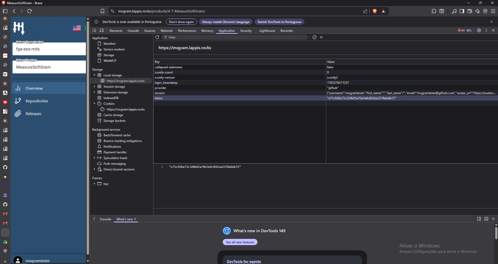

# Introdução

O _post mortem_ é uma análise final de um projeto após sua conclusão. O objetivo é revisar os sucessos, desafios, lições aprendidas e identificar pontos pendentes que podem ser desenvolvidos em iterações futuras. No contexto acadêmico, ele também serve para fornecer uma base sólida para que futuros estudantes ou equipes possam continuar o trabalho, evitando a repetição de erros e aprimorando o desenvolvimento.

# Análise da equipe

A equipe, no geral, se sentiu bastante desafiada com a proposta diferente do projeto. A maioria estava acostumada a trabalhar em projetos mais tradicionais, como sistemas de CRUD, onde as operações são claras e diretas. No entanto, com o MeasureSoftwareGram, a ideia de coletar medidas de repositórios e dados específicos, e não apenas gerenciar registros, trouxe uma nova dinâmica para o desenvolvimento.

# Pontos Pendentes

Para construir uma base inicial para os colegas do próximo semestre, a equipe reuniu uma série de pontos pendentes nos repositórios do projeto.

## Agente de IA (MCP):

Atualizar o meio que conseguimos o token de acesso, atualmente utilizamos a rota /api/v1/accounts/login/ porem com a implementação do login com github é necessário trocar isso, minhas sugestões são inserir o token de acesso como variável de ambiente no MCP e deixar no frontend depois que o usuário faz login um token como no github que disponibiliza um para logar. 

O token vai estar como na imagem assim como cookie do frontend:



Sendo assim no arquivo de login no AI, vcs podem colocar como variavel de ambiente de cara o token de acesso ao inves de utilizar a rota de login, ou fazer abrir o msgram em outra pagina do navegador e retornar isso quando rodar o MCP, existem varias formas:
  ```python
  import httpx

  class MsgramClient:
      def __init__(self, service: str, token: str):
          self.service = service
          self._auth_headers = {
              "accept": "application/json",
              "Authorization": f"Token {token}",
          }
          self._public_headers = {
              "accept": "application/json",
          }

      def _get(self, url: str, public: bool = False) -> httpx.Response:
          headers = self._public_headers if public else self._auth_headers
          response = httpx.get(url, headers=headers)
          if response.status_code == 500:
              raise RuntimeError("Erro interno no servidor.")
          response.raise_for_status()
          return response

      def query_list(self, url: str, public: bool = False) -> list[dict]:
          data = self._get(url, public=public).json()
          return data["results"] if "results" in data else data

      def query_detail(self, url: str, public: bool = False) -> dict:
          return self._get(url, public=public).json()
  ```

## Plugin:

- O problema de obtenção do token de acesso também se repete no Plugin, porém de forma diferente: hoje o token fica armazenado apenas no **cookie/local storage do navegador** (definido após o login via GitHub), o que torna sua obtenção muito difícil para quem precisa configurar o Plugin manualmente.
- É necessário encontrar uma forma de **deixar esse token mais visível/acessível ao usuário**, para que ele consiga localizá-lo e utilizá-lo sem precisar abrir as ferramentas de desenvolvedor do navegador (como Application > Local Storage) para copiá-lo manualmente. Ex: exibir o token em uma tela de perfil/configurações da aplicação, com opção de copiar.

## Vulnerabilidades

A análise de qualidade de código feita pelo SonarQube aponta vulnerabilidades ainda não tratadas em pelo menos um dos repositórios do projeto. No Plugin, por exemplo, a última análise (06/07/2026) resultou em Quality Gate Failed, com:

- **2 issues de Security** (classificação E);
- **20 issues de Reliability** (classificação C);
- **0.0% dos hotspots de segurança revisados**;

Um bom ponto de partida para o próximo semestre é priorizar a correção dessas issues, com atenção especial aos hotspots de segurança ainda não revisados. 
## Próximos Passos

Como direcionamento para as próximas iterações do projeto, a equipe sugere focar nas seguintes frentes:

1. **Consolidar qualidade** — Levar Action, Front e Service à meta de 85% de cobertura e resolver os pontos que ficaram em aberto: Reliability do Front, Quality Gate e Security do Plugin, e os hotspots do Service.
2. **Facilitar a entrada da nova equipe** — Manter a documentação de arquitetura e o fluxo de dados atualizados para encurtar a curva de aprendizado, sobretudo da lógica de coleta e modelagem de métricas.
3. **Evoluir o agente de IA** — Aprofundar o servidor MCP com repasse de identidade do usuário ao Service e facilitar a autenticação no MeasureSoftGram Service.
4. **Reduzir dívida técnica** — Endereçar, por repositório, os bugs e refatorações acumulados e estabilizar os pipelines de CI/CD que ainda falham.